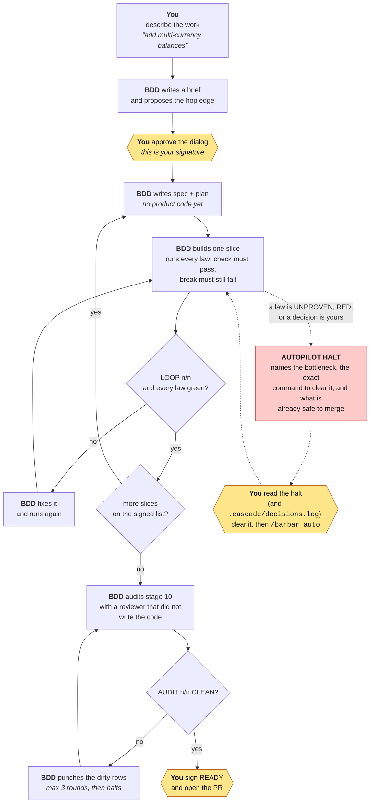

# Barbaric Driven Development

**Your coding agent will tell you it's done. This makes it prove it.**

BDD is a Claude Code plugin (and a plain git layer for every other agent) that turns "trust me, tests pass" into red tests, computed gates, and one-click human signatures — so a product built by agents stays *correct* after the model, the prompt, and the team have all changed.

```bash
claude plugin marketplace add kadaluarsa/barbaric-driven-development
claude plugin install bdd@bdd
```

Then open any repo and type what you want built. That's the install.

## What you get

- **Laws that can fail.** Declare a product law — *balance MUST NOT go negative* — with a validator *and* a red twin (a command that must fail). A law with no teeth is flagged `THEATER`; an unproven one blocks the loop. `DSHARP k/n` tells you the truth every time.
- **Gates that compute, not read.** Stage 10 is scored from the tree (`path:` exists, `test:` green); READY counts only when a human signed it; merge is `ALLOWED` or `REFUSED` by a script. The agent never types a score — and it cannot ask you to accept a hop it never ran the loop on: the accept edge needs a receipt naming that hop and fingerprinting that code, so a passing loop followed by more edits stops counting.
- **One click to sign.** Hop edges, laws, list changes: the agent proposes the exact edit, the permission dialog is your signature. No files to hand-edit, no keys to type.
- **Autopilot with a bar.** Sign a slice list once, run `/barbar auto`, sleep. It advances only while every law is green, and halts — never improvises — when one isn't. Every halt names the bottleneck, the exact command that clears it, and what is already safe to merge. `BDD_AUTOPILOT_MINUTES=90` bounds the night.
- **A record of the night.** Git records what succeeded. `.cascade/decisions.log` records what was denied, what you signed, which law went red at 3am, and why the run stopped — so the morning after is reading, not archaeology. It is a record, never a gate: delete it and no verdict changes.
- **Layers, not prompts.** CI › git hooks › agent hooks › rules. Turn the model off and the bar still holds.

## Measured, not asserted

| | |
|---|---|
| Fresh container, install from zero, every layer exercised | **22/22** |
| Real agent, headless, safeguards off except these, 7 conformance probes | **7/7** |
| Two features of rising difficulty + a trap that contradicts a law + audit + gate | **7/7** strict |
| Same, on autopilot with one `/barbar auto` | **4/4** |

The pack's own 18 invariants are mapped to the tests that hold them in [`CONTROL-LINE.md`](CONTROL-LINE.md) — including the two that nothing enforces yet, said out loud rather than papered over.

Eight earlier runs each found one thing — an installer that nested on upgrade, a law test rewritten to fit an API change, a "VIP exception" carved into *balance never negative* — and each became a test. Transcripts are in [`evals/`](evals/). The one failure the layers can't fully close is named in [`AUDIT.md`](AUDIT.md): a human still reads the diff at the edge.

## 30 seconds of use

You describe the work in your own words and approve two dialogs. Everything between them runs
unattended, and stops the moment a law it cannot satisfy gets in the way.

```
you:    add multi-currency balances; credit/debit take a currency code
agent:  drafts the brief, proposes the edge   → dialog: "HUMAN SIGNATURE NEEDED"
you:    approve
agent:  spec → build → LOOP n/n → next slice → … → AUTOPILOT HALT: list complete
you:    /audit, sign READY, /barbar merge → ALLOWED → open the PR

After a clone or an upgrade: `/doctor` (or `bdd doctor`) → `DOCTOR k/n`. It checks the layers, not just the files — `core.hooksPath` is git config and does not travel with a clone, so a repo can pass `bdd check` with a dead Layer 1.
```

Who does what:



**Amber is you** — three touch points: approve the edge, clear a halt if one comes, sign READY.
Everything else is the pack, and none of it can sign on your behalf.

Don't know your laws yet? `/barbar init` scans the repo and proposes them — proposals in their own
file, never written into the envelope. You sign what you accept. Safe to re-run on another machine
or months later; it skips laws already in force.

**Cloned onto a second machine?** The laws, tests and hooks all come with the repo — but
`core.hooksPath` is git config, not a file, so a fresh clone has the hooks on disk and git not
calling them. Re-run the pack's `install.sh` (or `git config core.hooksPath .githooks`) to wire
Layer 1 back up. A session that starts in an unwired clone says so.

## Who it's for

Teams shipping with coding agents who've been burned by a "done" that wasn't. Anything money, tenancy, safety or data loss makes unforgiving. Products meant to outlive the model that builds them.

Not for a weekend prototype — the hop edge is a cost you pay on purpose.

## Works with

Claude Code gets all four layers (plugin). Codex, Cursor, Copilot, Gemini, Aider, Windsurf, Zed and humans get the git hooks, CI and rules — the parts that don't need an agent's cooperation. Pairs with [Superpowers](https://github.com/obra/superpowers) for craft; BDD is the constitution, Superpowers is the toolkit.

## Read next

- [`USAGE.md`](USAGE.md) — the operator's manual: what you type, what you check, what `BLOCKED` means
- [`INTEGRATION.md`](INTEGRATION.md) — layers, per-agent matrix, conformance probes
- [`CONTROL-LINE.md`](CONTROL-LINE.md) — the law: I1–I18 with the test that holds each, T1–T41
- [`AUDIT.md`](AUDIT.md) — the honest audit, including where the ceiling is

MIT. Built by running it on itself until it stopped lying.
