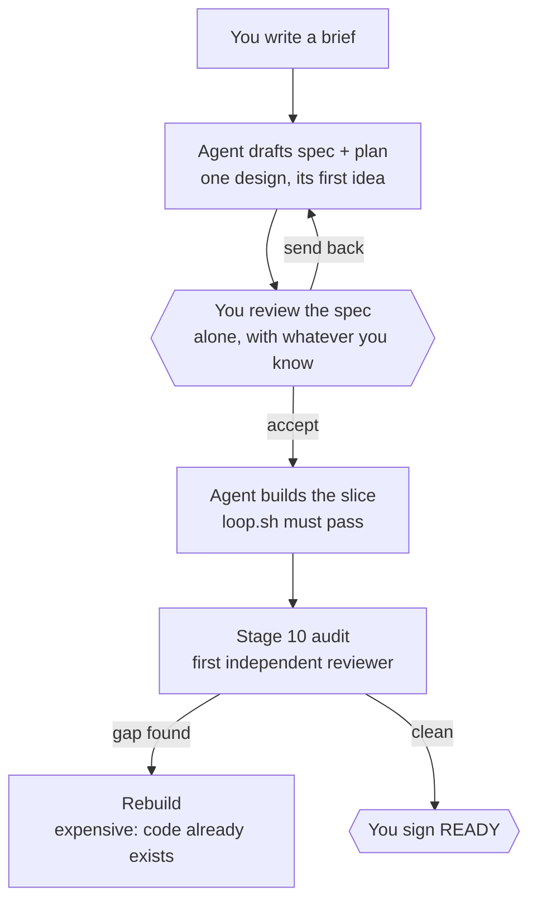
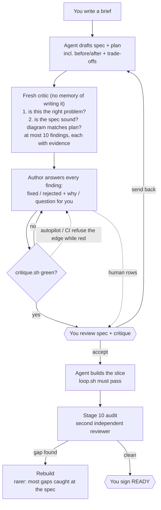

# Stage 05b — t57-spec-critic — SPEC

## User story IDs from the PRD

BDD's product is the cascade itself; the stories this slice serves:

- **S-SC1** — As an operator who is not an expert in every area a spec touches, I review a spec+plan
  **together with** a short, ranked list of concerns written by a reviewer that did not write it, each
  carrying evidence I can check myself — so a gap I would not have spotted reaches me as a question, not
  as a rebuild after stage 10.
- **S-SC2** — As an operator, I am told when the **brief itself** looks wrong (wrong problem, conflict
  with the envelope), before anything is designed on top of it.
- **S-SC3** — As an operator, I can understand a change without reading all of it: every spec carries a
  before/after diagram and a plain-language benefits and trade-offs table.
- **S-SC4** — As a maintainer, the critic can never become a new "trust me": it only advises. A script
  checks that every finding was **answered**, never whether the critic was **right**.

## The problem, stated as cost

Today a spec+plan has exactly one critic before it is built: the human at the `review spec+plan` edge.
The first independent reviewer the pack dispatches is the stage-10 auditor (`.claude/commands/barbar.md`,
"GENERATE 10 — adversarially"), and it arrives after the code exists. So a gap the human cannot see —
because they lack the expertise, or are tired, or the brief framed the wrong problem — costs a build hop
plus a punch round plus a rebuild, when the same gap caught at the spec costs one edit.

The human's limits are the bottleneck this slice targets. It does not remove them; it moves the first
independent look from after the build to before it, and hands the human findings they can **verify**
rather than **trust**.

## Before vs after

Before — the human is the only critic until stage 10:

After — a fresh critic reads the brief and the spec before you do:

Your touch points do not change in number. What changes is what you hold when you reach one.

## Benefits and trade-offs

| | What you get | What it costs | How the cost is contained | What remains |
|---|---|---|---|---|
| **Earlier catch** | Gaps found as spec edits, not rebuilds | One subagent per 05b GENERATE | Scoped to 05b; every other stage untouched | Tokens on every 05b GENERATE |
| **Checkable findings** | Evidence you can run or look up, not opinions | You still have to read up to 10 rows | Cap of 10, severity-ranked; `UNEVIDENCED` rows marked | A 10-row list is still reading |
| **Brief challenge** | Wrong-problem caught before design | Critic may second-guess a deliberate choice | You answer it once with `rejected <reason>` | Occasional noise |
| **Plain-language view** | Diagram + trade-off table on every spec | Author time per spec | The critic checks the diagram matches the plan | A script proves the diagram exists, not that it is accurate |
| **No new "trust me"** | Script checks answers, never verdicts | Critic's "looks fine" gives no guarantee | Critic is advisory by construction; scripts still decide | **Automation bias**: if you stop reading evidence, you are back to trusting |
| **Record** | Critique committed next to the spec | One more file per slice | Same directory, same naming | — |

The largest residual risk is the last-but-one row: the critic shares the model's blind spots (a fresh
context removes the *author's* assumptions, not the *model's*), and a human who cannot check it may
simply agree with it. The evidence column is the defence; the slice cannot enforce that you read it.

## What the slice adds — and the line it must not cross

1. **A critic pass on GENERATE of a 05b slice.** After the spec+plan are drafted and before the
   edge, the agent dispatches a **fresh subagent** with no memory of writing them, using one canonical
   brief (kept in `product-e2e-gre-pipeline.md`, cited by `barbar.md`):
   *"You are an independent critic. You did not write this. Read the brief line for this slice in
   `docs/cascade/05b-briefs.md`, `envelope.md`, `hop-state.md`, `AGENTS.md`, the spec+plan, and every file
   the PLAN says it will change — check its claims against the code, not against its own prose. First: is this the right problem, and
   does the brief conflict with any locked decision or law? Then: what in the spec+plan is missing,
   wrong, untestable, or hand-waved, and does its before/after diagram match the plan? Report at most 10
   findings, most severe first, as `| C# | severity | finding | evidence |` under `## Brief` and
   `## Spec`. Evidence is a command someone can run or a quoted `path:line`; if you have neither, write
   `UNEVIDENCED`. Write a literal pipe inside a cell as `\|`. Do not propose rewrites of the whole spec."*
2. **`docs/cascade/05b-<slice>-critique.md`** — the critic's rows kept **verbatim**, committed in
   their own commit before the author touches them and before any hop-edge commit (so the pre-commit
   autopilot check, which reads `HEAD` history, always finds the adding commit); then the author adds a `DISPOSITION` for each:
   `fixed <where>`, `rejected <reason>`, or `human <question>`. `human` rows are raised at the edge.
3. **Two required spec sections** for 05b specs: `## Before vs after` (≥2 `mermaid` blocks) and
   `## Benefits and trade-offs` (a table).
4. **`tests/critique.sh`** — the gate. On a **GENERATE 05b** hop, for the current slice only, it checks:
   the critique exists and is tracked; it has `## Brief` and `## Spec`; 1–10 finding rows (or an explicit
   `NO FINDINGS` line), each with severity `high|medium|low` and non-empty evidence; every row has a
   well-formed DISPOSITION; the **set** of C# ids and their first four columns match the commit that added
   the file (a deleted row fails as surely as an edited one); the spec has both required sections. Prints
   `CRITIQUE k/n`, exits non-zero unless k=n. On any other hop or stage — EXECUTE 05b included — it prints
   `CRITIQUE n/a` and exits 0: the critique gates the GENERATE edge, not the build.

   **Row format (C4).** Rows are split on *unescaped* `|` only; a pipe inside a cell is written `\|`, the
   markdown convention, so evidence like `grep -n x f \| head` parses as one cell. The critic brief says so.
5. **Gates at the edge.**
   - `stop_guard.py`: on a GENERATE 05b hop, a reply that prints `review spec+plan` is sent back
     if `tests/critique.sh` is red. It runs **before** the autopilot continuation branch, so autopilot
     cannot step past it. Like the I10 check it fires once per stop (`stop_hook_active`) — this is the
     soft layer, not the bar.
   - **CI (Layer 0, C5).** `control-line.yml` runs `bash tests/critique.sh` on every push (full history,
     `fetch-depth: 0`, so provenance works). It is `n/a` except while a GENERATE 05b hop is open, when a
     red critique turns CI red — the layer no agent can talk past.
   - `tests/lib/autopilot.py`: the GENERATE→EXECUTE edge for a 05b entry additionally requires
     `tests/critique.sh` exit 0.

**The line it must not cross:** the critic never decides anything. No code path turns a critic's
opinion into a pass or a fail; `critique.sh` scores shape and completeness of *answers* only. The critic
cannot edit the spec, and the author cannot edit the critic's rows (the git-provenance check).

## Acceptance criteria

- **AC1** — `bash tests/critique.sh` prints `CRITIQUE n/n` and exits 0 on a well-formed fixture
  (critique + spec with both sections) in a scratch git repo on GENERATE 05b.
- **AC2 — THE RED TWIN.** `CRITIQUE_MUTANT=<m>` corrupts the fixture and `critique.sh` MUST exit non-zero
  for each `m`: `missing` (no critique file), `undispositioned` (a row with an empty DISPOSITION),
  `rewritten` (a critic column edited after the adding commit), `deleted` (a critic row removed after
  the adding commit), `pipes` (evidence with an unescaped `|` that shifts the columns), `nodiagram` (spec lacks
  `## Before vs after` or its mermaid blocks), `overcap` (11 rows), `noevidence` (empty evidence cell).
- **AC3** — `stop_guard.py` blocks `STITCH NEEDED: review spec+plan for stage 05b` on a GENERATE 05b hop
  while `critique.sh` is red, and lets it through when green.
- **AC4** — `autopilot.py` refuses GENERATE→EXECUTE for a 05b entry without a green critique, and allows
  it with one. The stop_guard check runs even when autopilot has signed edges left.
- **AC4b** — CI: `control-line.yml` runs `tests/critique.sh` with full history; a fixture repo on GENERATE
  05b with a red critique makes that step exit non-zero.
- **AC5** — Scope is exact: on GENERATE of any stage but 05b, and on every EXECUTE hop, `critique.sh`
  prints `CRITIQUE n/a`, exits 0, and no gate changes behaviour. `bash tests/enforcement.sh` T8–T54 stay
  green.
- **AC6** — Existing slices are not retro-failed: `critique.sh` checks only the current hop's slice.
- **AC7** — Docs agree with code (C1): the canonical critic brief lives in `product-e2e-gre-pipeline.md`;
  `barbar.md` step 1 and the "After GENERATE" line cite it; `AGENTS.md` rule 7 and the `autopilot.py`
  docstring name the green critique as a GENERATE→EXECUTE condition for 05b; `USAGE.md` explains the
  critique file and dispositions in plain language.

## Laws

`NO D# IN FORCE`. This slice proposes none: it is pipeline tooling, not product physics. AC2 is a new
`tests/ac/` script plus a new `T57` in `tests/enforcement.sh` — numbered after the slice, as T52–T54
are; T55/T56 do not exist because those slices kept their tests in `tests/ac/` only; it neither changes nor adds under any
existing `tests/inv/*` (I13).

## PLAN

0. **`tests/lib/cascade.sh`** — add `cascade_slice()` beside `cascade_stage()`, reading `CURRENT_SLICE:`
   from `cascade_hopstate` so it honours `CASCADE_ENVELOPE` like the others (C6).
1. **`tests/critique.sh`** — reads hop/stage/slice via `cascade_hop`/`cascade_stage`/`cascade_slice`; resolves the
   spec (`docs/cascade/<stage>-<slice>.md`) and critique path; runs the checks in "What the slice adds"
   §4 with one `t`-style line each; `CRITIQUE k/n`; honours `CRITIQUE_MUTANT` only inside its AC fixture
   (the variable is read by the AC script's fixture builder, not by the gate, so it cannot weaken the real
   gate).
2. **Provenance check** — `git log --diff-filter=A --format=%H -1 -- <critique>`; compare columns 1–4 of
   each row at that commit against the working tree, and require the same set of C# ids (C3). Untracked
   critique, or no adding commit in reachable history (a shallow clone) → fail with the reason; never
   pass by default.
3. **`stop_guard.py`** — **before** the autopilot continuation branch (C5): if hop is GENERATE, stage 05b, the last message
   contains `review spec+plan`, and `critique.sh` exits non-zero → exit 2 with its failing lines.
4. **`tests/lib/autopilot.py`** — in the GENERATE branch, for stage 05b, run `critique.sh` against the
   pre-edge envelope (same `CASCADE_ENVELOPE` trick as the loop gate); non-zero → refuse with its reason.
5. **`tests/ac/t57_spec_critic.sh`** — scratch git repo fixture: hop-state on GENERATE 05b, a spec with
   both sections, a critique committed raw then dispositioned. AC1 on the clean fixture; AC2 one sub-case
   per mutant; AC6 an older slice with no critique present is ignored.
6. **`tests/enforcement.sh` T57** — AC3 (stop_guard both sides, with and without signed autopilot edges
   left), AC4 (autopilot `decide` both sides), AC5 (GENERATE 06 and EXECUTE 05b: `n/a`, gates unchanged).
6b. **CI** — `control-line.yml`: `fetch-depth: 0` and a `bash tests/critique.sh` step (AC4b).
7. **Docs** — canonical critic brief + "After GENERATE" line in `product-e2e-gre-pipeline.md`; `barbar.md`
   step 1 gains "dispatch the critic, commit its rows, disposition them, run `tests/critique.sh`";
   `AGENTS.md` rule 7 and the `autopilot.py` docstring (C1); `USAGE.md` section.
8. **Version** — `VERSION` 1.10.0 (+ `plugin.json` / `marketplace.json` per T31), `CHANGELOG` entry.
9. **Verify** — `goal.md`: `bash tests/ac/t57_spec_critic.sh`, `bash tests/enforcement.sh`;
   `bash tests/loop.sh` to n/n; re-read the diff adversarially.

**Not in this slice** (each its own hop):
- **t58-divergence** — candidates before the spec; it reuses this critic to rank them.
- **Critic on stage 05 and 06–09 GENERATE** — stage 05 has no slice path to key a critique on and is
  never on autopilot (C2); 06–09 have different spec shapes. Follow-up once 05b proves out.
- **`stop_guard.py` false edges** — the hook demands an edge line on a question-only reply and reads a
  prose mention of a halt as a halt. Real, observed this session, but a separate brief.

## Decision for the human (flag at the edge)

Critique: `05b-t57-spec-critic-critique.md` — 10 findings, all answered `fixed`; none left for you.

1. **Scope 05b only.** Stage 05 was in the brief; the critic showed it has no slice path and no
   autopilot edge (C2), so it is deferred. Recommended: prove it on 05b before widening.
2. **Cap of 10 findings.** Lower means less to read and more risk a real finding is cut; 10 is my pick.
3. **Provenance by git, not by hash.** It catches an author editing the critic's rows *after* they were
   committed. It cannot catch a doctored *first* commit — the git history is there for you to read, and
   no in-repo check can prove what a subagent said before it was written down. Said out loud rather than
   papered over.
4. **AUTOPILOT list.** It still names only `05b t56-dsharp-parallel` (done). To let autopilot take t57's
   EXECUTE edge, add `05b t57-spec-critic` to it yourself; otherwise you take that edge by hand.
