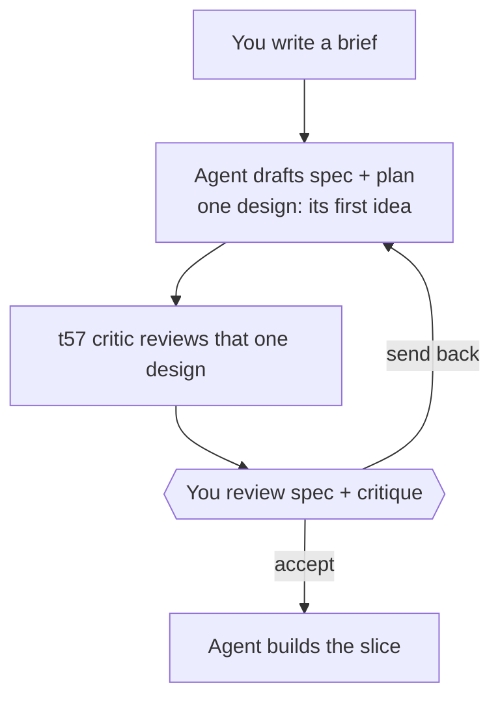
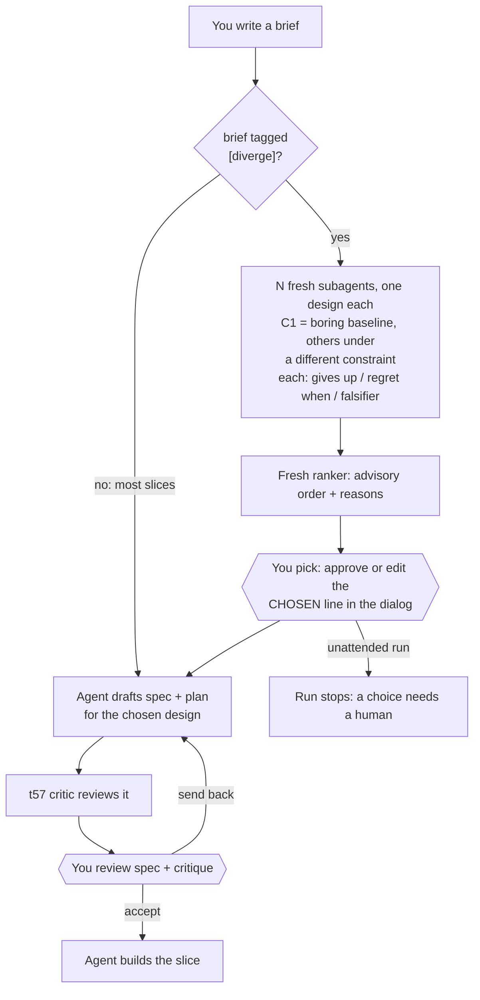

# Stage 05b — t58-divergence — SPEC

## User story IDs from the PRD

BDD's product is the cascade itself; the stories this slice serves:

- **S-DV1** — As an operator who does not know every way a problem can be solved, I can ask for a slice
  to be **diverged**: before any spec is written I see several genuinely different designs, one of them
  always the boring baseline, so an option I did not know to ask for gets a chance.
- **S-DV2** — As an operator who cannot judge designs on expertise alone, each option tells me in plain
  words what it gives up, when I would regret it, and a **cheap test that would prove it wrong**, so I
  choose by evidence rather than by trusting whoever sounds most confident.
- **S-DV3** — As an operator, the **choice is mine**: the agent can recommend, but only my signature
  picks the design; unattended runs stop at the choice instead of making it.
- **S-DV4** — As a maintainer, routine slices pay nothing: an untagged slice runs GENERATE exactly as
  today.

## The problem, stated as cost

Every spec today is built on the agent's first idea. Stage 05 asks for "one stack … and a rejected
alternative" (`docs/cascade/stages/05-tech-design.md`), and a 05b slice gets no alternatives at all. The
human sees one design and can only accept it or send it back — they never see the option they did not
know existed. When that first idea is the wrong architecture, the cost is a whole slice built on it; the
cost of comparing three short candidates first is minutes.

t57 put a critic on the spec. A critic can only improve the design in front of it; it cannot surface the
design nobody wrote. This slice supplies the missing half: **divergence before convergence**.

## Before vs after

Before — the design is the agent's first idea:

After — a slice tagged `[diverge]` shows you the options first; untagged slices are unchanged:

## Benefits and trade-offs

| | What you get | What it costs | How the cost is contained | What remains |
|---|---|---|---|---|
| **Options you didn't know to ask for** | 3+ designs before any spec | N+1 subagents per tagged slice | Opt-in per slice with `[diverge]`; untagged slices unchanged | You decide which slices are worth it |
| **Choose by evidence** | Each option has a falsifier: a command or experiment that would prove it wrong | You still have to read N short entries | Fixed fields, plain language, an advisory ranking | Reading is not free |
| **Boring stays the default** | C1 is always the baseline | Clever options invite harder-to-verify designs | The baseline is the one to beat, and the ranking says why | You may still pick the clever one |
| **Your choice, your signature** | The pick is a signed `CHOSEN` line | One more dialog on tagged slices | It is the same dialog you already use for hop edges | Unattended runs stop at every tagged slice |
| **Honest check** | The script proves each option is complete and textually distinct | "Distinct text" is not "genuinely different idea" | Distinct constraints + an overlap threshold | **It cannot prove novelty.** Five rewordings with different constraint labels could pass. Said out loud. |
| **Same model, same instincts** | A fresh context per candidate | Candidates may still cluster | Each candidate works under a different forbidden pattern or priority | No temperature control in Claude Code; variety comes from the prompt only |

## What the slice adds — and the line it must not cross

1. **The tag.** A brief opts in by starting its text with `[diverge]` or `[diverge N]`, **after** the
   colon: `- <slug>: [diverge] …`. It goes after the colon because `tests/doctor.sh` finds briefs with
   `^- <slug>:`, and a tag before the colon would hide the brief from it. N defaults to 3, minimum 2,
   maximum 5.
2. **Candidates.** On GENERATE 05b of a tagged slice, **before writing the spec**, the agent writes the
   constraint list (C1 = `baseline`, then one distinct constraint per slot) and dispatches one fresh
   read-only subagent per slot, in parallel, using one canonical brief kept in
   `product-e2e-gre-pipeline.md` ("Divergence"). Each returns exactly one candidate:
   `### C# — <name>` followed by `constraint:`, `approach:`, `gives up:`, `regret when:`,
   `failure modes:`, `falsifier:`. The falsifier must name a runnable command or a concrete experiment
   in backticks. Candidates are written **verbatim** to `docs/cascade/05b-<slice>-candidates.md`,
   together with an **empty** choice placeholder `<EDIT>CHOSEN:</EDIT>`, and committed before anything
   else touches them — the provenance rule from t57. The placeholder matters: the pack's `<EDIT>` guards
   (`hop_guard.py`, `.githooks/pre-commit` via `tests/lib/edit_tags.py`) let an agent **add** a new
   `<EDIT>` block but never **change** the content of one that exists. Committing the empty block first
   is what makes filling it a signature, not a write.
3. **Ranking.** A separate fresh subagent reads the brief, the envelope and the candidates and writes an
   advisory `## Ranking` (order + one line of reason each, and which falsifier to run first). It is
   advice, like the critic.
4. **The choice.** The agent proposes filling the committed placeholder with `CHOSEN: C# — <reason>`,
   pre-filled with the ranker's top pick. Changing existing `<EDIT>` content is human-owned, so the edit
   raises the **HUMAN SIGNATURE NEEDED** dialog: approving signs the pick; denying sends it back, and
   the human names another. Headless or `bypassPermissions`, `hop_guard.py` denies it — so an
   unattended run **cannot** choose, by construction, not by prose.
5. **The spec** for a diverged slice carries `## Chosen design` naming the `CHOSEN` id; everything
   after that is today's GENERATE plus the t57 critic.
6. **`tests/diverge.sh`** (`DIVERGE k/n`), for GENERATE 05b of a tagged slice only (`n/a` otherwise):
   the candidates file exists and is committed at HEAD; at least N candidates; every field non-empty;
   C1's constraint is `baseline`; constraints pairwise distinct; no two `approach` texts overlap by more
   than 0.6 (Jaccard on lowercased word sets); every falsifier has a backticked command or experiment;
   the candidate blocks are unchanged since the commit that added the file, and that commit held the
   **empty** placeholder `<EDIT>CHOSEN:</EDIT>` (so the pick was a change to existing `<EDIT>` content,
   which only a signature allows); now exactly one `CHOSEN: C#` line, inside `<EDIT>`, naming an
   existing candidate; the spec
   exists and its `## Chosen design` names that id.
7. **Gates.** The t57 hook generalises: `stop_guard.py` refuses `review spec+plan` on GENERATE 05b while
   `tests/critique.sh` **or** `tests/diverge.sh` is red; `autopilot.py` requires both green for
   GENERATE→EXECUTE; `control-line.yml` runs `tests/diverge.sh` in CI.

**The line it must not cross:** the script never judges which design is better, and nothing but the
human's signature selects one. Untagged slices change in no way at all.

## Acceptance criteria

- **AC1** — On a clean tagged fixture (3 candidates, ranking, signed `CHOSEN`, spec naming it),
  `bash tests/diverge.sh` prints `DIVERGE n/n` and exits 0; `[diverge 4]` requires 4.
- **AC2 — THE RED TWIN.** Each `DIVERGE` mutant turns it red: `missing` (no candidates file), `short`
  (fewer than N), `clone` (two near-identical approaches), `samecon` (two identical constraints),
  `nobaseline` (C1 not `baseline`), `nofalsifier` (a falsifier with no backticked command),
  `emptyfield` (a field blank), `rewritten` (a candidate edited after its adding commit),
  `prechosen` (the adding commit already had an id in `CHOSEN`, or had no placeholder — a new `<EDIT>`
  block is not a signature), `nochoice` (no `CHOSEN`), `unsigned`
  (`CHOSEN` outside `<EDIT>`), `badchoice` (`CHOSEN` names a missing id), `specmiss` (spec's
  `## Chosen design` absent or names another id).
- **AC3** — Untagged: GENERATE 05b of an untagged slice, and every EXECUTE hop, print `DIVERGE n/a` and
  exit 0. The documented tag form `- <slug>: [diverge] …` is still found by `doctor.sh`'s `^- <slug>:`
  brief check (fixture).
- **AC4** — `stop_guard.py` refuses `review spec+plan` on a tagged GENERATE 05b while `diverge.sh` is
  red, even with signed autopilot edges left; passes when both it and `critique.sh` are green.
- **AC5** — `autopilot.py` refuses GENERATE→EXECUTE for a tagged 05b entry while `diverge.sh` is red.
- **AC6** — The choice cannot be made unattended: with `permission_mode: bypassPermissions`, an Edit
  that fills the committed `<EDIT>CHOSEN:</EDIT>` placeholder is **denied** by `hop_guard.py`, and
  interactively it answers `ask`; `.githooks/pre-commit` refuses the same change committed without a
  signature.
- **AC7** — CI runs `bash tests/diverge.sh`; docs agree with code: the canonical Divergence brief in the
  pipeline doc, `barbar.md` (both copies), `AGENTS.md` rule 7, `USAGE.md`, `CONTROL-LINE.md` (T58),
  `CHANGELOG`.

## Laws

`NO D# IN FORCE`. This slice proposes none: it is pipeline tooling. AC2 is a new `tests/ac/` script and
a new `T58` in `tests/enforcement.sh`, named after the slice as T57 is; it touches no `tests/inv/*`
(I13).

## PLAN

1. **`tests/lib/diverge.py`** — parses the brief tag (`^- <slug>: \[diverge( \d)?\]`), the candidates
   file (`### C#` blocks, field lines, `## Ranking`, `CHOSEN` inside `<EDIT>`), the spec's
   `## Chosen design`; runs the checks in §6 with git provenance as `critique.py` does; prints
   `DIVERGE k/n` or `DIVERGE n/a`. Shared helpers (`git`, `section`, provenance) are lifted from
   `critique.py` into `tests/lib/provenance.py` so both scripts use one implementation.
2. **`tests/diverge.sh`** — thin wrapper, like `tests/critique.sh`.
3. **`stop_guard.py`** — `critique_red` becomes `spec_gate_red`, running `critique.sh` then
   `diverge.sh`, each only if present; message names whichever is red.
4. **`tests/lib/autopilot.py`** — the 05b GENERATE→EXECUTE check runs both scripts.
5. **`hop_guard.py` / pre-commit** — no change: they already make *changing* existing `<EDIT>`
   content sign-or-deny, and deliberately let a *new* block through. The design leans on exactly that
   (empty placeholder committed first); AC6 proves it against the real hooks rather than assuming it.
6. **`tests/ac/t58_divergence.sh`** — fixture builder + AC1–AC3 and the 13 mutants.
7. **`tests/enforcement.sh` T58** — AC4, AC5, AC6 against the real hooks.
8. **CI** — `control-line.yml` step `bash tests/diverge.sh`.
9. **Docs** — canonical "Divergence" subagent brief and ranker brief in the pipeline doc (inside the
   conductor block, beside "Spec critic"); `barbar.md` step 1 (both copies); `AGENTS.md` rule 7;
   `USAGE.md` (word table + score rows); `CONTROL-LINE.md` T58 row + range; `CHANGELOG` 1.11.0;
   `VERSION` + `plugin.json` + `marketplace.json`.
10. **Verify** — `goal.md`: the t58 AC script, `enforcement.sh`, `lint.sh`; `bash tests/loop.sh` n/n;
    farm; re-read the diff adversarially.

**Not in this slice:**
- **Divergence on stage 05** — no slice path, never on autopilot (same reason t57 deferred it).
- **Running the falsifiers automatically** — they are for the human to run or ask for; wiring them into
  a gate would make the script judge designs, which is the line this slice must not cross.
- **`stop_guard.py` false edges** on question-only replies — still real, still a separate brief.

## Decision for the human (flag at the edge)

1. **How you pick: the dialog.** The agent pre-fills `CHOSEN` with the ranker's top pick and the dialog
   asks you; approve to accept it, deny and name another. The alternative — stop the hop and have you
   type the line — is one more round trip for the same signature. Recommended: the dialog.
2. **N = 3 by default, 2–5 allowed.** More than 5 is reading, not choosing.
3. **Overlap threshold 0.6.** Lower rejects more near-duplicates and more honest variants that share
   domain vocabulary; 0.6 is my pick, and the fixture pins both sides of it.
4. **The novelty limit.** The check proves completeness and distinct text, not distinct ideas. The
   ranking and your reading are the only defence against five rewordings of one design.
