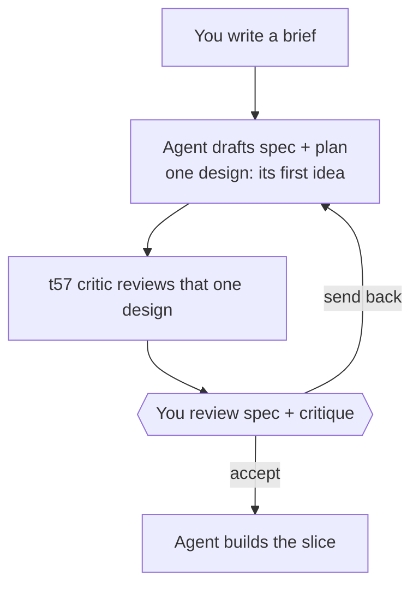
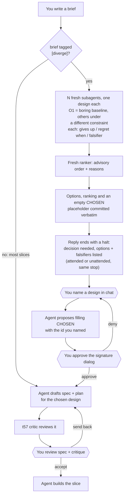

# Stage 05b — t58-divergence — SPEC

## User story IDs from the PRD

BDD's product is the cascade itself; the stories this slice serves:

- **S-DV1** — As an operator who does not know every way a problem can be solved, I can ask for a slice
  to be **diverged**: before any spec is written I see several genuinely different designs, one of them
  always the boring baseline, so an option I did not know to ask for gets a chance.
- **S-DV2** — As an operator who cannot judge designs on expertise alone, each option tells me in plain
  words what it gives up, when I would regret it, and a **cheap test that would prove it wrong**, so I
  choose by evidence rather than by trusting whoever sounds most confident.
- **S-DV3** — As an operator, the **choice is mine**: the agent can recommend, but only my signature
  picks the design; unattended runs stop at the choice instead of making it.
- **S-DV4** — As a maintainer, routine slices pay nothing: an untagged slice runs GENERATE exactly as
  today.

## The problem, stated as cost

Every spec today is built on the agent's first idea. Stage 05 asks for "one stack … and a rejected
alternative" (`docs/cascade/stages/05-tech-design.md`), and a 05b slice gets no alternatives at all. The
human sees one design and can only accept it or send it back — they never see the option they did not
know existed. When that first idea is the wrong architecture, the cost is a whole slice built on it; the
cost of comparing three short candidates first is minutes.

t57 put a critic on the spec. A critic can only improve the design in front of it; it cannot surface the
design nobody wrote. This slice supplies the missing half: **divergence before convergence**.

## Before vs after

Before — the design is the agent's first idea:

After — a slice tagged `[diverge]` shows you the options first; untagged slices are unchanged:

## Benefits and trade-offs

| | What you get | What it costs | How the cost is contained | What remains |
|---|---|---|---|---|
| **Options you didn't know to ask for** | 3+ designs before any spec | N+1 subagents per tagged slice, and one extra reply | Opt-in per slice with `[diverge]`; untagged slices unchanged | You decide which slices are worth it |
| **Choose by evidence** | Each option has a falsifier: a command or experiment that would prove it wrong | You read N short entries and name one | Fixed fields, plain language, an advisory ranking | Reading is not free |
| **Boring stays the default to beat** | O1 is always the baseline | Clever options invite harder-to-verify designs | The ranking must say why anything beats O1 | You may still pick the clever one |
| **Your choice, your signature** | Nothing is pre-filled; you name the design, then sign it | One halt + one dialog per tagged slice | The same dialog you already use for hop edges | Unattended runs stop at every tagged slice — by design |
| **Honest check** | The script proves each option is complete, has its own constraint and falsifier, and is not a copy-paste of another | Word overlap catches copies, **not paraphrases** (a reworded twin scored 0.41 against a 0.6 bar) | Distinct constraints and distinct falsifiers carry the rest | **It cannot prove the ideas differ.** The ranking and your reading are the defence. |
| **Signature as strong as a hop edge** | The pick counts only once committed, and committing it changes existing `<EDIT>` content | Needs Layer 1 (`core.hooksPath`) on | `doctor` already reports a dead Layer 1 | With Layer 1 off, a pick is exactly as unguarded as every hop edge in the pack |
| **Same model, same instincts** | A fresh context per option | Options may still cluster | A different forbidden pattern or priority per option | No temperature control in Claude Code; variety comes from the prompt only |

## What the slice adds — and the line it must not cross

1. **The tag.** A brief opts in by starting its text with `[diverge]` or `[diverge N]`, **after** the
   colon: `- <slug>: [diverge] …`. After the colon because `tests/doctor.sh:196` finds briefs with
   `^- <slug>:`. N defaults to 3, minimum 2, maximum 5. It lives in the brief, not an env var, so it is
   durable and per-slice (the t56 lesson: `DSHARP_SERIAL` as an env var is not recorded anywhere).
2. **Options.** On GENERATE 05b of a tagged slice, **before any spec**, the agent writes the constraint
   list (O1 = `baseline`, then one distinct forbidden pattern or single priority per slot) and dispatches
   one fresh read-only subagent per slot using the canonical "Divergence" brief in
   `product-e2e-gre-pipeline.md`. Each returns exactly one option: `### O# — <name>` followed by
   `constraint:`, `approach:`, `gives up:`, `regret when:`, `failure modes:`, `falsifier:`. The
   falsifier names a runnable command or concrete experiment in backticks. Ids are `O#` (option), never
   `C#`, so they cannot be confused with t57 critique rows.
3. **Ranking.** A separate fresh subagent writes `## Ranking`: a numbered list (not a table), one line of
   reason per option, and which falsifier to run first. Advisory only.
4. **Commit, with one empty choice placeholder.** Options + ranking are written verbatim to
   `docs/cascade/05b-<slice>-candidates.md` with **exactly one** `<EDIT>CHOSEN:</EDIT>` block, and
   committed before anything else touches them.
5. **The pause — one shape, attended or not.** That reply ends with a halt, which `stop_guard.py`
   already accepts as a legal ending: `AUTOPILOT HALT: decision needed — pick a design for 05b <slice>`,
   followed by the required `BOTTLENECK / WHAT TO DO / IF YOU DISAGREE / RESUME WITH / DONE SO FAR`
   block, where WHAT TO DO lists each option's name, what it gives up, and its falsifier. No dialog is
   left hanging, and an unattended run stops here for the same reason an attended one does.
6. **The choice.** The human names an option in chat. Only then does the agent propose filling the
   placeholder with `CHOSEN: O# — <the human's reason>`; the agent never pre-fills its own or the
   ranker's pick. Changing existing `<EDIT>` content raises the **HUMAN SIGNATURE NEEDED** dialog
   (Layer 2) and is refused at commit without a signature (Layer 1, `edit_tags.py`), whatever tool made
   the change. Deny returns to the human naming another.
7. **The spec** carries `## Chosen design` naming that `O#`; the rest is today's GENERATE plus the t57
   critic, ending at `review spec+plan`.
8. **`tests/diverge.sh`** (`DIVERGE k/n`), GENERATE 05b of a tagged slice only (`n/a` otherwise). It
   reads the candidates file **as committed at HEAD** — an uncommitted pick does not count — and checks:
   at least N options; every field non-empty; O1's constraint is `baseline`; constraints pairwise
   distinct; falsifiers pairwise distinct and each with a backticked command or experiment; no two
   `approach` texts with word-set overlap above 0.6 (a copy-paste catcher, nothing more); the option
   blocks unchanged since the adding commit; the adding commit held exactly one `<EDIT>` block
   containing `CHOSEN`, and it was empty; HEAD holds exactly one such block, now naming an existing
   `O#`; the spec exists and its `## Chosen design` names the same id. Before the pick it prints
   `DIVERGE k/n — waiting on your choice`, so the halt reads as expected, not as a failure to fix.
9. **Gates.** `stop_guard.py` refuses `review spec+plan` on GENERATE 05b while `tests/critique.sh` **or**
   `tests/diverge.sh` is red; `autopilot.py` requires both green for GENERATE→EXECUTE (on a tagged slice
   this also stands behind its loose "spec doc present" glob, which the candidates file alone would
   satisfy); `control-line.yml` runs `tests/diverge.sh` in CI.

**The line it must not cross:** the script never judges which design is better, the agent never picks,
and untagged slices change in no way at all.

## Acceptance criteria

- **AC1** — A clean tagged fixture (3 options, ranking, empty placeholder committed, then a committed
  fill naming O2, spec naming O2) prints `DIVERGE n/n` and exits 0; `[diverge 4]` requires 4.
- **AC2 — THE RED TWIN.** Each mutant turns it red: `missing`, `short` (fewer than N), `clone`
  (copy-pasted approach), `samecon`, `samefals` (two identical falsifiers), `nobaseline`, `nofalsifier`
  (no backticks), `emptyfield`, `rewritten` (an option edited after its adding commit), `prechosen`
  (adding commit already named an id), `noplaceholder` (adding commit had no `CHOSEN` block),
  `secondblock` (a second `<EDIT>CHOSEN: O2</EDIT>` added beside the empty one — C3),
  `uncommittedpick` (the fill exists only in the working tree — C4), `badchoice` (names a missing id),
  `specmiss` (spec's `## Chosen design` absent or naming another id).
- **AC3** — GENERATE 05b of an untagged slice, and every EXECUTE hop, print `DIVERGE n/a` and exit 0;
  a brief in the documented form `- <slug>: [diverge] …` is found by `doctor.sh`'s brief check.
- **AC4** — `stop_guard.py`, on a tagged GENERATE 05b with `diverge.sh` red: refuses `review
  spec+plan` (also with signed autopilot edges left); **accepts** the decision-needed halt with its
  instruction block as the reply's ending; passes `review spec+plan` once both gates are green.
- **AC5** — `autopilot.py` refuses GENERATE→EXECUTE for a tagged 05b entry while `diverge.sh` is red.
- **AC6** — The pick is a signature at every layer that can see it: an Edit filling the committed
  placeholder answers `ask` interactively and is **denied** under `bypassPermissions` (Layer 2); the
  same change made by a shell command and committed with Layer 1 on is **refused** by pre-commit
  without a signature (Layer 1).
- **AC7** — CI runs `bash tests/diverge.sh`; docs agree with code: canonical Divergence + ranker briefs
  in the pipeline doc, `barbar.md` (both copies), `AGENTS.md` rule 7, `USAGE.md`, `CONTROL-LINE.md`
  (T58), `CHANGELOG`.

## Laws

`NO D# IN FORCE`. This slice proposes none: it is pipeline tooling. AC2 is a new `tests/ac/` script and
a new `T58` in `tests/enforcement.sh`, named after the slice as T57 is; it touches no `tests/inv/*`
(I13).

## PLAN

1. **`tests/lib/provenance.py`** — lift `git`, `section` and the adding-commit lookup out of
   `critique.py` so both gates share one implementation; `critique.py` imports it (t57's AC script and
   T57 must stay green).
2. **`tests/lib/diverge.py`** — parses the brief tag (`^- <slug>: \[diverge( [2-5])?\]`), the
   candidates file at HEAD (`### O#` blocks, fields, `<EDIT>` blocks containing `CHOSEN`), the adding
   commit's version, and the spec's `## Chosen design`; runs §8's checks; prints `DIVERGE k/n`,
   `… — waiting on your choice` before the pick, or `DIVERGE n/a`.
3. **`tests/diverge.sh`** — thin wrapper, like `tests/critique.sh`.
4. **`stop_guard.py`** — `critique_red` becomes `spec_gate_red`, running `critique.sh` then
   `diverge.sh` (each only if present); the message names the red one. The existing halt handling
   already lets `AUTOPILOT HALT` + `WHAT TO DO` end a hop; AC4 pins that.
5. **`tests/lib/autopilot.py`** — the 05b GENERATE→EXECUTE check runs both scripts.
6. **`hop_guard.py` / pre-commit** — no change: they already make *changing* existing `<EDIT>` content
   sign-or-deny and let a *new* block through; the design commits the empty placeholder first and
   `diverge.sh` forbids a second block, so the new-block path cannot carry a pick. AC6 proves both layers.
7. **`tests/ac/t58_divergence.sh`** — fixture builder + AC1–AC3 and the 15 mutants.
8. **`tests/enforcement.sh` T58** — AC4, AC5, AC6 against the real hooks and a real pre-commit.
9. **CI** — `control-line.yml` step `bash tests/diverge.sh`.
10. **Docs** — "Divergence" (option subagent + ranker briefs, the halt shape, the no-pre-fill rule)
    in the conductor block beside "Spec critic"; `barbar.md` step 1 (both copies); `AGENTS.md` rule 7;
    `USAGE.md`; `CONTROL-LINE.md` T58 + range; `CHANGELOG` 1.11.0; `VERSION`, `plugin.json`,
    `marketplace.json`.
11. **Verify** — `goal.md`: the t58 AC script, the t57 AC script, `enforcement.sh`, `lint.sh`;
    `bash tests/loop.sh` n/n; farm; re-read the diff adversarially.

**Not in this slice:**
- **Divergence on stage 05** — no slice path, never on autopilot (same reason t57 deferred it).
- **Running the falsifiers automatically** — wiring them into a gate would make the script judge
  designs, the line this slice must not cross.
- **A `bash_guard` rule for `<EDIT>`** — shell writes are caught where they matter, at commit (Layer 1);
  a shell-pattern guard for arbitrary file content would be easy to evade and noisy.
- **`stop_guard.py` false edges** on question-only replies — still real, still a separate brief.

## Decision for the human (flag at the edge)

Critique: `05b-t58-divergence-critique.md` — 10 findings, all answered; the design changed on C1, C3,
C4, C5 and C7.

1. **How you pick: halt, then name it, then sign it.** Two touches (say the id, approve the dialog) and
   one extra reply per tagged slice. The alternative the critic ruled out — a pre-filled pick you
   approve with one click — is faster and anchors you on the agent's choice.
2. **N = 3 by default, 2–5 allowed.**
3. **Copy-paste threshold 0.6.** It only catches copies. Tightening it enough to catch paraphrases
   (≈0.4) would also reject honest options that share the domain's vocabulary.
4. **Signature strength = hop-edge strength.** With Layer 1 off (as in this clone today), a pick is as
   unguarded as every hop edge in the pack. The fix is `git config core.hooksPath .githooks`, not a new
   mechanism.
5. **Departures from the brief, named (C2):** `DIVERGE_N` became the `[diverge N]` tag (durable,
   per-slice); the ranker is a separate fresh subagent, not the t57 critic (the critic reviews one spec,
   the ranker compares options); mutant names follow the new checks (`nobaseline`, `nofalsifier`, …).
   Say if you want the brief's originals instead.
