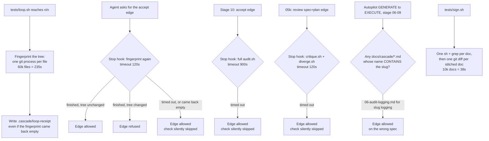
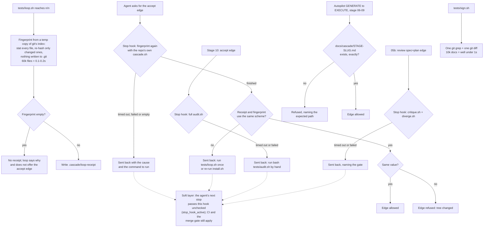

# Stage 05b — t59-scale-hardening — SPEC

## User story IDs from the PRD

BDD's product is the cascade itself; the stories this slice serves:

- **S-SH1** — As an operator of a repo that has been under the cascade for years, asking for the accept
  edge costs me about the same as it did in year one: the tree fingerprint behind the loop receipt costs
  time in proportion to what changed, not to how big the repo has become.
- **S-SH2** — As an operator, a Stop-hook check that cannot finish **tells me so and sends the agent back**
  with the cause and the command to run. It never waves the edge through silently.
- **S-SH3** — As an operator, signing a change (`bash tests/sign.sh`) takes about the same time whether
  `docs/` holds 50 spec docs or 10,000, and whether 5 or 5,000 of them carry `<EDIT>` blocks.
- **S-SH4** — As an operator running autopilot on stages 06–09, an old spec doc whose name merely
  *contains* the new slice's slug can never stand in for that slice's missing spec.

## The problem, stated as cost

Measured this session on a synthetic ten-year repo: 60,060 tracked files (50,000 source + 10,000 spec and
critique docs), 5,000 briefs, 150 laws, 3,000 audit rows, BDD installed as `tests/enforcement.sh`'s
`mkrepo` does, every law and test command `true` so the numbers show BDD's own overhead. PLAN step 7
commits the generator so these numbers can be reproduced.

| What | Today, 60k files | Why |
|---|---|---|
| Hooks on every prompt, Write and Bash | 40–65ms | flat — reads a few small files |
| Stop hook at a turn end | 86ms | flat |
| A 10-file commit through `pre-commit` | 195ms | flat — works on staged paths only |
| Parsing 150 laws | 28ms | flat |
| **`cascade_worktree_sha`** | **235s** | one `git hash-object` process per file (`tests/lib/cascade.sh:95–102`) |
| **`bash tests/loop.sh`** with one `VALIDATOR: true` | **217s** | almost all of it the receipt fingerprint above (`tests/loop.sh:130`) |
| **`sign.sh`'s `<EDIT>` scan** | **38s** | one `sh` + `grep` per tracked doc (`tests/sign.sh:19`), then one `git diff` per human-owned file (`:25–28`) |

Three of the Stop hook's checks do worse than cost time: they turn off without saying so.

1. **The I10 receipt check fails open.** `stop_guard.py` runs the fingerprint with `timeout=120`, treats any
   exception as "cannot verify: do not invent a failure" — `return True, ""` — and also passes when the
   fingerprint comes back empty (`if now and now != rsha`, `.claude/hooks/stop_guard.py:229–235`). At 235s
   the call always times out, so **past roughly 30k files on this machine the "tree changed after
   `tests/loop.sh` passed" check stops running**. The receipt must still exist and name the hop, and the
   merge gate is untouched, but I10's core — "that run describes this code" — is no longer checked.
2. **The stage-10 check fails open the same way.** On stage 10 the Stop hook runs the whole `tests/audit.sh`
   under `timeout=900`, and an exception is again `return True, ""` (`stop_guard.py:203–208`).
3. **The spec-gate check fails open too.** `spec_gate_red` runs `critique.sh` and `diverge.sh` under a
   120s timeout and skips them on any exception, "same rule as the I10 evidence check"
   (`stop_guard.py:131–132`, `:152–155`, per the critic's C8).

And one check is loose in a way that gets worse with age. Autopilot accepts the GENERATE→EXECUTE edge if
**any** `docs/cascade/*.md` contains the slug as a **substring** of its name (`tests/lib/autopilot.py:83–84`).
For **05b** this is already covered: autopilot also runs `tests/critique.sh`, which requires the exact
`docs/cascade/05b-<slug>.md` (`tests/lib/critique.py:68`, `:79`). So on 05b the change alters no verdict in
any repo that has t57 (critic C1). For **06–09** nothing stands behind the glob, so after years of slugs
an old `06-audit-logging.md` satisfies a new `06 logging` entry that has no spec.

## Before vs after

Before — cost grows with the repo, and three checks switch off when they cannot finish:

After — cost follows what changed, and a check that cannot finish sends the agent back with a reason:

**What "fail closed" means here.** The Stop hook is the soft layer (I18), and it fires once per stop:
when the agent stops again straight after being sent back (`stop_hook_active`), the hook lets it through
without re-checking (`stop_guard.py:318–319`, per the critic's C10; the same behaviour t57 documents at
`docs/cascade/05b-t57-spec-critic.md:113`). So after this slice a check that cannot finish produces a
**visible refusal with a cause**, not a wall. Today it produces **nothing at all**. The hard layers —
`pre-commit`, CI, `tests/barbar.sh merge` — are unchanged.

## Benefits and trade-offs

| | What you get | What it costs | How the cost is contained | What remains |
|---|---|---|---|---|
| **Index fingerprint** | Loop receipt and accept edge in ~0.1–0.2s at 60k files (from 235s), measured | A temp copy of the index and a temp object directory per run | Both deleted on exit; new blobs go to the temp directory (the real `.git/objects` stays untouched, measured); the real index is never written | Untracked non-ignored files are still hashed on every run, as today — a 1GB untracked dataset costs about as much as it does now |
| **More sensitive fingerprint** | A `chmod +x`, a symlink retarget, or an embedded repo moving to another commit now counts as a change | A change of that kind asks for one more loop run | Documented in CHANGELOG | Symlink *targets* outside the repo are no longer followed (today they are) — Decision 4 |
| **Scheme check** | After an upgrade the Stop hook says "different pack version, run the loop once", not a misleading "tree changed". Plugin-mode repos whose `tests/` are older than the plugin keep working | One extra loop run per repo, once | The hook compares its own fingerprint (from the repo's `cascade.sh`) with the receipt (from the repo's `loop.sh`), so both sides always come from the same version (critic C2) | — |
| **Visible refusal instead of silent pass** | A check that cannot finish can no longer slip through unannounced | The agent is sent back once where it used to slip through | Once per stop; the message names the cause and the command | It is a message, not a wall: the agent's next stop passes (soft layer). A 15-minute stage-10 audit is still 15 minutes at every accept-edge stop (follow-up) |
| **Loop without a fingerprint** | `loop.sh` no longer writes a receipt it cannot back, or offers the accept edge without one | On a tree that cannot be fingerprinted, the loop exits non-zero where it used to exit 0 | The message says why and what to check | — |
| **Two-process sign scan** | `sign.sh` finds and diffs human-owned files in one `git grep` and one `git diff`, whatever the doc count | None beyond the change itself | AC4 proves the same targets as today | Hashing each *changed* target is still one process per changed file, which is fine |
| **Exact spec match, 06–09** | An old spec can never satisfy a new slug on 06–09 | A 06–09 spec not named `<stage>-<slug>.md` stops satisfying autopilot | The refusal names the exact expected path | On 05b nothing changes: `critique.sh` already required the exact name |

## What the slice adds — and the line it must not cross

1. **`cascade_worktree_sha` from a temp copy of git's index** (`tests/lib/cascade.sh`), prototyped this hop on
   the 60k-file fixture:
   - Copy the real index with its timestamp preserved (`cp -p` of `git rev-parse --git-path index`, which
     also works in linked worktrees; start from an empty temp index when none exists). The preserved mtime
     keeps git's racy-entry protection: an edit in the same second as the last index write is still
     re-hashed.
   - In the temp copy, clear assume-unchanged and skip-worktree bits. It takes one `update-index` call per
     flag: one call with both flags clears only the first, which I verified. Otherwise edits to such files
     would be invisible, where today's code sees them (critic C3).
   - Force stat checking for this command only: `-c core.trustctime=true -c core.checkStat=default
     -c core.fsmonitor=false -c core.ignoreStat=false -c core.untrackedCache=false`. With ctime trusted, an
     edit that restores the file's size and mtime (`touch -r`) is still caught, since ctime cannot be set back.
   - Run `git add -A --ignore-errors -- . ':(exclude).cascade'` and then `git write-tree`, with
     `GIT_INDEX_FILE` set to the temp index, `GIT_OBJECT_DIRECTORY` set to a temp directory, and
     `GIT_ALTERNATE_OBJECT_DIRECTORIES` set to the real object store. New blobs land in the temp directory
     and are deleted with it; **nothing is written to `.git`** (critic C6). Print `t2:<tree>`.
   - **File set.** Same as today: tracked files plus untracked non-ignored files, `.cascade/` excluded,
     deletions counted, and an untracked embedded repo *without* a commit ignored (today's `[[ -f ]]` skips
     it; `--ignore-errors` skips it here). More sensitive than today: file mode, symlinks as links, and an
     embedded repo or submodule *with* a commit counting by that commit. An unreadable file counts by name
     only, as today.
   - Any failure (not a git repo, a git error before `write-tree`) prints nothing. §3b and §3 make every
     caller treat empty as "no fingerprint" (critic C4).
2. **Scheme check** (`stop_guard.py`, receipt branch). The hook computes the fingerprint with the repo's own
   `tests/lib/cascade.sh`, the same file the repo's `loop.sh` used for the receipt. If the receipt's third
   field and the fresh fingerprint differ in scheme (one starts with `t2:`, the other does not), the hook
   refuses with *"the loop receipt and this repo's fingerprint come from different pack versions — run
   `bash tests/loop.sh` once; if this repeats, re-run install.sh so the repo's tests/ match the plugin"*.
   When the schemes match, the values are compared as today. A plugin-mode repo whose `tests/` are older than
   the plugin therefore keeps working: old `loop.sh` and old `cascade.sh` agree with each other (critic C2).
3. **Stop hook: a check that cannot finish sends the agent back, in all three places** (`stop_guard.py`).
   - **Receipt branch** (`:229–235`): a timeout, an exception or an empty fingerprint refuses with
     *"could not fingerprint the tree (<cause>) — run `bash tests/loop.sh` again; if it keeps failing, run
     `bash -c '. tests/lib/cascade.sh; cascade_worktree_sha .'` by hand (in a plugin-mode repo, re-run
     install.sh first)"*. It no longer returns `True, ""`.
   - **Stage-10 branch** (`:203–208`): a timeout or exception refuses with *"tests/audit.sh did not finish
     (<cause>) — run `bash tests/audit.sh` by hand; the stage-10 edge needs CLEAN"*. `punch_round` is
     **not** incremented: a round that never scored is not a round.
   - **Spec gates** (`spec_gate_red`, `:131–132`, `:152–155`): a timeout or exception running `critique.sh`
     or `diverge.sh` counts as red, naming the gate and the cause (critic C8). Its docstring's "same rule as
     the I10 evidence check" stays true, because that rule changes with it.
   - The timeouts keep their defaults (120s, 900s, 120s). `CASCADE_STOP_FINGERPRINT_TIMEOUT`,
     `CASCADE_STOP_AUDIT_TIMEOUT` and `CASCADE_STOP_GATE_TIMEOUT` can lower them for tests. Since a timeout
     now refuses, these variables can only make the hook refuse sooner, never pass.
   - The docstring's "audit.sh is cheap" becomes the measured truth: cheap for small repos, bounded by their
     tests for large ones.
   3b. **`tests/loop.sh`** (`:128–132`): when the fingerprint is empty, write no receipt, print *"LOOP n/n,
   but the tree could not be fingerprinted — no receipt written, so the accept edge would be refused: run
   `bash -c '. tests/lib/cascade.sh; cascade_worktree_sha .'` to see why"*, do not print the accept-edge
   line, and exit 1. This changes behaviour only on trees the fingerprint cannot read. Today those produce a
   receipt the Stop hook misreports as "loop never passed" (critic C4).
4. **Two-process sign scan** (`tests/sign.sh`). `human_owned` uses one
   `git grep -l -F '<EDIT>' -- 'docs/**/*.md' 'docs/*.md'` in place of `ls-files | xargs sh -c grep`. Same
   pathspecs, so git applies the same matching rules, over the same tracked files and working-tree content.
   The target filter then runs one `git diff --name-only HEAD -- docs/ tests/inv/`, intersected with the
   human-owned list in the shell, in place of one `git diff --quiet HEAD` per file (critic C7). In a repo
   with no commits, every human-owned file is a target, as today.
5. **Exact spec match** (`tests/lib/autopilot.py`). The GENERATE→EXECUTE edge needs
   `docs/cascade/<stage>-<slug>.md` to exist, exactly, and the refusal names that path. For 05b this is the
   path `critique.sh` already requires, so no 05b verdict changes. For 06–09 it closes the substring hole.

**The line it must not cross (I18):** no verdict changes on any tree the current code could check in time,
except where this spec names it. The fingerprint must change on every content, add or delete that changes
today's (AC2 checks each). The sign scan must find exactly today's targets (AC4). Every gate that passed with
a real, finished check still passes. What changes, and only this: a check that timed out or failed now sends
the agent back instead of passing; `loop.sh` refuses to offer an edge it cannot back; and a 06–09 slice
needs its exactly named spec. No law, no `tests/inv/*` file, no `<EDIT>` block and no validator is touched.

## Acceptance criteria

- **AC1 — fingerprint process count does not grow with the file count.** In scratch repos, a PATH shim counts
  `git` invocations during one `cascade_worktree_sha`. The count on a 50-file repo **equals** the count on a
  500-file repo. **Red twin:** the AC embeds today's per-file implementation and asserts that the same check
  **fails** on it, because its count grows with the file count.
- **AC2 — fingerprint correctness.** Two runs on the same tree print the same `t2:` value. Each of these
  changes it: a one-byte edit to a tracked file; the same edit made in the same second as the commit; a
  same-size edit with the mtime restored by `touch -r`; a new untracked non-ignored file; a deleted tracked
  file; `chmod +x`; an edit to an assume-unchanged file; an edit to a skip-worktree file. None of these change
  it: a new ignored file; a new file under `.cascade/`; staging an edit with `git add`; an untracked embedded
  repo with no commit. After every run, the real index file's hash, `git diff --cached --name-only`, the
  index flags (`git ls-files -v`) and the file count under `.git/objects` are all unchanged. It works in a
  repo with no commits and in a linked worktree, and prints nothing outside a git repo.
- **AC3 — Stop hook sends back on a check that cannot finish.** The fixture holds a copy of the **whole**
  hooks directory, since `stop_guard.py` imports `_common` from beside itself (critic C9). With the timeout
  variables at 1s, and a slow stub for each check (a `cascade_worktree_sha` that sleeps; a `10-audit.md` row
  whose `test:` sleeps; a `critique.sh` that sleeps), `stop_guard.py` blocks the matching edge line with the
  cause and the command to run, for all three. The stage-10 punch counter is unchanged. An empty fingerprint
  is refused the same way. A fast matching receipt still passes, and a stale one still refuses (T41
  unchanged). With `stop_hook_active` set, the hook lets the retry stop through, as documented.
  **Red twin:** the same fixture with the receipt branch patched back to `return True, ""` makes AC3 fail.
- **AC3b — scheme check.** A bare-sha receipt paired with a `t2:` fingerprint is refused with the
  "different pack versions" message, not "the tree changed". A bare-sha receipt paired with a fixture
  whose `cascade.sh` still prints bare shas (plugin mode, `tests/` not yet refreshed) is compared normally:
  matching passes, and changed refuses with "tree changed".
- **AC3c — loop without a fingerprint.** With a stub `cascade_worktree_sha` that prints nothing, `loop.sh`
  on an all-green goal writes no receipt, prints the "could not be fingerprinted" line, prints no accept-edge
  line, and exits 1.
- **AC4 — sign-scan equivalence and cost.** On a fixture with `<EDIT>` in top-level and nested docs, a tracked
  doc deleted from the working tree, an untracked doc containing `<EDIT>`, a non-doc file containing
  `<EDIT>`, some stitched docs changed against HEAD and some not, the new target computation prints exactly
  the list today's prints (today's code is embedded in the AC for comparison). It uses a constant number of
  `git`, `grep` and `sh` processes whether the fixture has 20 docs or 200, with 10 or 100 of them stitched.
  **Red twin:** today's code fails the constant-count check.
- **AC5 — exact spec match.** With `AUTOPILOT: 06 logging`, a committed `06-audit-logging.md` and no
  `06-logging.md`, autopilot refuses GENERATE→EXECUTE and names `docs/cascade/06-logging.md`. With
  `06-logging.md` present, it allows the edge. **Red twin, on this 06 case:** a copy of `autopilot.py` with
  the substring test restored allows the collision, which makes AC5 fail (critic C5: on 05b both versions
  refuse, because `critique.sh` needs the exact name). The 05b case is checked for no change: `05b login`
  with only `05b-login-rate-limit.md` is refused, as it is today.
- **AC6 — nothing else moves.** `bash tests/enforcement.sh` (T8–T58 plus a new T59 for AC3–AC3c),
  `bash tests/ac/t57_spec_critic.sh` and `bash tests/ac/t58_divergence.sh` stay green, and
  `bash tests/lint.sh` passes with T59 documented in README, CONTROL-LINE and AUDIT.
- **AC7 — the ten-year numbers, reproduced.** `bash tests/stress/ten_year.sh` builds the 60k-file fixture and
  prints the fingerprint, `loop.sh` and sign-scan times. On the EXECUTE hop it is run once, and its output is
  pasted into the hop report: fingerprint and sign scan each under 1s, and `loop.sh` (one `true` validator)
  under 5s. It is opt-in — not in `goal.md`, CI or the farm — because building the fixture takes about two
  minutes.

## Laws

`NO D# IN FORCE`. `envelope.md` declares no law (its only `###` block is the `{{…}}` template). This slice
proposes none: it is pipeline tooling, not product physics. It neither changes nor adds anything under
`tests/inv/*` (I13). The new tests are `tests/ac/t59_scale_hardening.sh` and `T59` in `tests/enforcement.sh`,
numbered after the slice as T57/T58 are.

## PLAN

0. **`tests/lib/cascade.sh`** — rewrite `cascade_worktree_sha` per §1. The header comment states the file set,
   the sensitivity differences, the `t2:` scheme, and the guarantee that nothing is written to `.git`.
1. **`tests/loop.sh`** — per §3b.
2. **`.claude/hooks/stop_guard.py`** — in `hop_evidence_ok`: the scheme check (§2) and fail-closed receipt
   branch (§3); the fail-closed stage-10 branch with no `punch_round` on timeout (§3). In `spec_gate_red`: the
   fail-closed gate runs (§3). The three env-overridable timeouts. The docstrings.
3. **`tests/sign.sh`** — per §4.
4. **`tests/lib/autopilot.py`** — the exact path per §5. The refusal names it. The module docstring line "if a
   spec doc for the slice exists under docs/cascade/" becomes "if `docs/cascade/<stage>-<slice>.md` exists".
5. **`tests/ac/t59_scale_hardening.sh`** — AC1, AC2, AC4 and AC5 with their red twins, in scratch repos. It sets
   its own `GIT_CONFIG_GLOBAL=/dev/null`, so a user's signing config cannot slow or break it.
6. **`tests/enforcement.sh` T59** — AC3, AC3b and AC3c through the real hook and a real `loop.sh`, the way T41
   drives them. Its fixture copies the whole hooks directory.
7. **`tests/stress/ten_year.sh`** — the generator behind the numbers above, made standalone (AC7). It takes
   the file count as an argument (default 60,000) and cleans up after itself.
8. **Docs** — CONTROL-LINE.md row `| T59 |` and the `T8–T59` ranges in README.md, CONTROL-LINE.md and AUDIT.md
   (lint). USAGE.md §B3: the exact spec name autopilot needs for 06–09. A USAGE.md line on the Stop hook's
   "could not finish" messages and what to do about them.
9. **Version** — `VERSION` and `.claude-plugin/plugin.json` / `marketplace.json` (T31), set to the version you
   pick at this edge (Decision 1). A CHANGELOG entry covering: the one-time loop re-run after upgrade; mode,
   symlink and embedded-repo sensitivity; the send-back messages; `loop.sh` refusing without a fingerprint;
   and the exact 06–09 spec name.
10. **Verify** — `goal.md`: `VALIDATOR: bash tests/ac/t59_scale_hardening.sh`,
    `bash tests/ac/t57_spec_critic.sh`, `bash tests/ac/t58_divergence.sh`, `bash tests/enforcement.sh`,
    `bash tests/lint.sh`. Run `bash tests/loop.sh` to n/n; run `bash tests/stress/ten_year.sh` once and paste
    its output (AC7); re-read the diff adversarially.

**Not in this slice** (each its own brief, in the order I would take them):
- **Hermetic git config in every fixture builder** — `enforcement.sh` and the `tests/ac/*` scripts inherit
  the user's global git config. Here commit signing cost ~100ms per test commit (t58 ran in 6.3s, and 3.3s
  without it). A machine with signing on and gpg missing would see test commits fail. It is small, and it is
  a correctness bug; I recommend it next.
- **Split `enforcement.sh` into one file per case and run cases in parallel** — prototyped: 82s → 27s
  on 4 cores with all 49 verdicts identical, 22.7s with hermetic git config.
- **Per-slice case selection in `goal.md`**, with CI and the merge gate still running every case.
- **Run a hop's validators in parallel in `loop.sh`**, collected in declared order as `dsharp_strength.sh`
  does.
- **No duplicate runs** — the merge gate runs `dsharp_strength.sh` twice (inside `audit.sh`, then directly;
  32.5s → ~16s on an 8-law fixture); `audit.sh` re-runs a `test:` shared by several rows; CI runs
  `enforcement.sh` three times per PR.
- **A stage-10 audit receipt**, so a long audit is not repeated at every accept-edge stop. That needs its
  own threat analysis, because a receipt in `.cascade/` can be written by hand, where today's live audit
  cannot be faked.
- **Laws at scale** — split the gate's law checks across CI runners, and time each law in
  `dsharp_strength.sh`. Whether the dev loop may run only the laws a slice touches is an I13 question that
  only you can answer.

## Decisions for the human (flag at the edge)

Critique: `05b-t59-scale-hardening-critique.md` — 10 findings, all answered `fixed`; none left for you.

1. **Version number.** I recommend **2.1.0**. The loose match only changes verdicts on 06–09 and was
   accepting the wrong document; the timeout "pass" was a silent skip. `loop.sh` now exits 1 on a tree it
   cannot fingerprint, where it exited 0 before, but it could never have produced a usable receipt there.
   By 2.0.0's own precedent (a stricter gate that refuses a previously passing edge), you could call it
   **3.0.0**. Your call; the plan uses whichever you name.
2. **Exact spec name for 06–09 on autopilot.** A 06–09 slice whose spec is not named `<stage>-<slug>.md`
   will be refused, with the expected path in the message. I found no test, doc or eval that names a
   06–09 spec any other way.
3. **Sent back, not walled off.** The Stop hook is the soft layer and fires once per stop, so a check that
   cannot finish produces one visible refusal with a cause, and the agent's next stop passes. Making it a
   wall would trap sessions whenever git misbehaves. Keeping today's behaviour means silence. The hard
   layers are where a wall belongs, and they are unchanged.
4. **Symlink targets.** The fingerprint now records a symlink as a link. Today it follows the link and
   hashes the target's content. Nothing in the pack depends on the old behaviour, but a product that keeps
   generated files outside the repo behind symlinks would see edits there stop counting.
