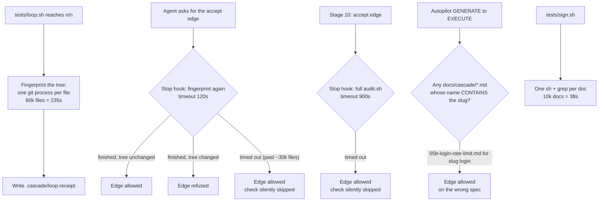
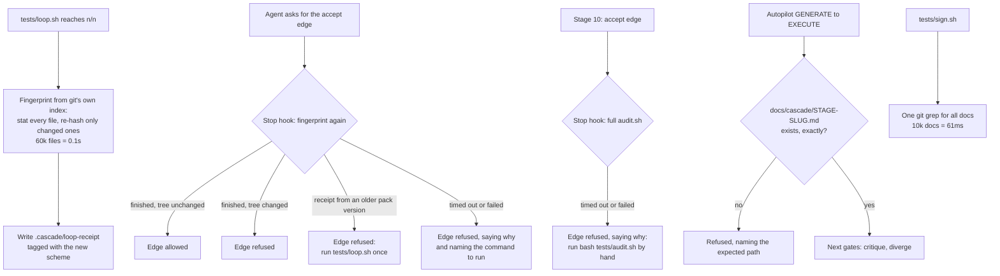

# Stage 05b — t59-scale-hardening — SPEC

## User story IDs from the PRD

BDD's product is the cascade itself; the stories this slice serves:

- **S-SH1** — As an operator of a repo that has been under the cascade for years, asking for the accept
  edge costs me about the same as it did in year one: the tree fingerprint behind the loop receipt costs
  time in proportion to what changed, not to how big the repo has become.
- **S-SH2** — As an operator, a gate that cannot finish in time **tells me so and refuses**. It never waves
  the edge through with the check turned off, and it names the command to run by hand.
- **S-SH3** — As an operator, signing a change (`bash tests/sign.sh`) takes about the same time whether
  `docs/` holds 50 spec docs or 10,000.
- **S-SH4** — As an operator running autopilot for years, an old spec doc whose name merely *contains*
  the new slice's slug can never stand in for that slice's missing spec.

## The problem, stated as cost

Measured this session on a synthetic ten-year repo: 60,060 tracked files (50,000 source + 10,000 spec and
critique docs), 5,000 briefs, 150 laws, 3,000 audit rows, BDD installed as `tests/enforcement.sh`'s
`mkrepo` does, every law and test command `true` so the numbers show BDD's own overhead. PLAN step 6
commits the generator so these numbers can be reproduced.

| What | Today, 60k files | Why |
|---|---|---|
| Hooks on every prompt, Write and Bash | 40–65ms | flat — reads a few small files |
| Stop hook at a turn end | 86ms | flat |
| A 10-file commit through `pre-commit` | 195ms | flat — works on staged paths only |
| Parsing 150 laws | 28ms | flat |
| **`cascade_worktree_sha`** | **235s** | one `git hash-object` process per file (`tests/lib/cascade.sh:95–102`) |
| **`bash tests/loop.sh`** with one `VALIDATOR: true` | **217s** | almost all of it the receipt fingerprint above (`tests/loop.sh:130`) |
| **`sign.sh`'s `<EDIT>` scan** | **38s** | one `sh` + `grep` per tracked doc (`tests/sign.sh:19`) |

Two of these do worse than cost time: they turn a check off without saying so.

1. **The I10 receipt check fails open.** `stop_guard.py` runs the fingerprint with `timeout=120` and treats
   any exception as "cannot verify: do not invent a failure" — `return True, ""`
   (`.claude/hooks/stop_guard.py:229–234`). At 235s the call always times out, so **past roughly 30k files
   on this machine the "tree changed after `tests/loop.sh` passed" check stops running**. The receipt must
   still exist and name the hop; the merge gate is untouched. But I10's core — "that run describes this
   code" — silently stops being checked.
2. **The stage-10 check fails open the same way.** On stage 10 the Stop hook runs the whole `tests/audit.sh`
   under `timeout=900`, and an exception is again `return True, ""` (`stop_guard.py:203–208`). An audit that
   takes longer than 15 minutes lets the edge through unchecked.

And one check gets weaker with age rather than slower: autopilot accepts the GENERATE→EXECUTE edge if **any**
`docs/cascade/*.md` has the slug as a **substring** of its name (`tests/lib/autopilot.py:83–84`). After years
of slugs, `05b-login-rate-limit.md` satisfies a new slice `login` that has no spec at all. t58's critic
already noted the same looseness for the candidates file (`05b-t58-divergence-critique.md`, C10).

## Before vs after

Before — cost grows with the repo, and two checks switch off when they run out of time:

After — cost follows what changed, and a check that cannot finish refuses with a reason:

A refusal from the Stop hook sends the agent back **once**. The hook fires once per stop
(`stop_hook_active`, as the I10 and critique checks already do — `docs/cascade/05b-t57-spec-critic.md:113`),
so failing closed never traps a session. It turns silence into a message.

## Benefits and trade-offs

| | What you get | What it costs | How the cost is contained | What remains |
|---|---|---|---|---|
| **Index fingerprint** | Loop receipt and accept edge in ~0.1s at 60k files (from 235s) | `git add` into a *temporary* index writes blobs for changed files into `.git/objects` | Same blobs a commit would write; unreachable ones are pruned by `git gc`. The real index is copied, never touched | Loose objects between gcs |
| **More precise fingerprint** | A `chmod +x` or a new symlink now counts as a change | A mode-only change asks for one more loop run | Documented in CHANGELOG | Symlink *targets* outside the repo are not followed (they were before) |
| **Receipt scheme tag** | After upgrading, the Stop hook says "receipt from an older version, run the loop once", not a misleading "tree changed" | One extra loop run per repo, once | The message names the command | — |
| **Fail closed on timeout** | A check that cannot finish can no longer pass silently | The agent is sent back once where it used to slip through | Once per stop; the message names the cause and the command | A 15-minute stage-10 audit is still 15 minutes at every accept-edge stop (follow-up below) |
| **One-pass `<EDIT>` scan** | `sign.sh` in ~60ms at 10k docs (from 38s) | None beyond the change itself | AC4 proves the same file set as today | — |
| **Exact spec match** | An old spec can never satisfy a new slug | A 06–09 spec not named `<stage>-<slug>.md` stops satisfying autopilot | The refusal names the exact expected path | Anyone relying on loose naming renames one file (Decision 2) |

## What the slice adds — and the line it must not cross

1. **`cascade_worktree_sha` from git's index** (`tests/lib/cascade.sh`). Copy the real index
   (`git rev-parse --git-path index`, so linked worktrees work) to a temp file, or start from an empty temp
   index if there is none. Run `GIT_INDEX_FILE=<tmp> git add -A -- . ':(exclude).cascade'`, then
   `GIT_INDEX_FILE=<tmp> git write-tree`, and print `t2:<tree-sha>`. git re-hashes only files whose stat
   data differs from the copied index, so cost follows what changed since the last commit or refresh. The
   file set is the same as today: tracked files plus untracked non-ignored files, `.cascade/` excluded,
   deletions counted. It also now covers file mode and symlinks as links. Any failure (not a git repo, git
   error) prints nothing, which every caller already treats as "no fingerprint". The real index, staging
   area and HEAD are never modified; the temp file is removed on exit.
2. **Receipt scheme tag.** `loop.sh` keeps writing `<hop> <stage> <fingerprint>`; the `t2:` prefix marks the
   scheme. On the accept edge, `stop_guard.py` reads a receipt whose third field lacks the current prefix as
   *"written by an older version of the pack — run `bash tests/loop.sh` once"*, and refuses.
3. **Fail closed in `stop_guard.py`, both branches.**
   - Receipt branch (`:229–234`): a timeout, an exception or an empty fingerprint refuses the edge with
     *"could not fingerprint the tree (<cause>) — run `bash tests/loop.sh` again; if it keeps failing, run
     `bash -c '. tests/lib/cascade.sh; cascade_worktree_sha .'` by hand"*. It no longer returns
     `True, ""`.
   - Stage-10 branch (`:203–208`): a timeout or exception refuses with *"tests/audit.sh did not finish
     (<cause>) — run `bash tests/audit.sh` by hand; the stage-10 edge needs CLEAN"*. `punch_round` is
     **not** incremented: a round that never scored is not a round.
   - The two timeouts stay 120s and 900s by default and can be lowered for tests through
     `CASCADE_STOP_FINGERPRINT_TIMEOUT` and `CASCADE_STOP_AUDIT_TIMEOUT`. Now that a timeout refuses, the
     variables can only make the hook refuse sooner, never pass.
   - The docstring's "audit.sh is cheap" claim is replaced by the measured reality: cheap for small repos,
     bounded by its tests for large ones.
4. **One-pass `<EDIT>` scan in `tests/sign.sh`.** `human_owned` runs
   `git grep -l -F '<EDIT>' -- 'docs/**/*.md' 'docs/*.md'` in place of `ls-files | xargs sh -c grep`. Same
   pathspecs, so git applies the same matching rules, over the same tracked files and working-tree content.
5. **Exact spec match in `tests/lib/autopilot.py`.** The GENERATE→EXECUTE edge needs
   `docs/cascade/<stage>-<slug>.md` to exist, exactly — the path `tests/critique.sh` already assumes for
   05b (`tests/lib/critique.py:68`). The refusal names that path. `-critique.md` and `-candidates.md` can no
   longer stand in for a spec, which closes t58's C10.

**The line it must not cross (I18):** no verdict changes on any tree the current code could check in time.
The fingerprint must still change on any content, add or delete that changes today's. The `<EDIT>` scan must
find exactly today's files. Every gate that passed with a real, finished check still passes. Only the
timed-out "pass" becomes a refusal, and only the substring-matched spec becomes a missing spec. No law, no
`tests/inv/*` file, no `<EDIT>` block and no validator is touched.

## Acceptance criteria

- **AC1 — fingerprint cost does not grow with the file count.** In a scratch repo, a PATH shim counts `git`
  invocations during one `cascade_worktree_sha`. The count on a 50-file repo **equals** the count on a
  500-file repo. **Red twin:** the AC embeds today's per-file implementation and asserts the same check
  **fails** on it (its count grows with the file count), so the check can tell the two apart.
- **AC2 — fingerprint correctness.** Two runs on the same tree print the same `t2:` value, and each of these
  changes it: a one-byte edit to a tracked file, a new untracked non-ignored file, a deleted tracked file,
  `chmod +x` on a tracked file. None of these change it: a new ignored file, a new file under `.cascade/`,
  staging an edit with `git add` (the fingerprint describes the working tree, not the index). After every
  run, `git diff --cached --name-only` and the real index file's hash are unchanged. It works in a repo with
  no commits and in a linked worktree (`git worktree add`), and prints nothing outside a git repo.
- **AC3 — Stop hook fails closed.** With the timeout variables set to 1 and a fixture whose fingerprint
  (a stub `cascade_worktree_sha` that sleeps) or `audit.sh` (a row whose `test:` sleeps) outlasts them,
  `stop_guard.py` blocks `STITCH NEEDED: accept execute for stage N` with the cause and the command to run,
  on both branches. The stage-10 punch counter is unchanged. A fast, matching receipt still passes, and a
  stale one still refuses (T41 unchanged). **Red twin:** a copy of `stop_guard.py` in the fixture with the
  timeout branch patched back to `return True, ""` makes this AC fail.
- **AC3b — legacy receipt.** A receipt whose third field is a bare 40-hex sha (today's format) is refused
  with the "older version — run `bash tests/loop.sh` once" message, not "the tree changed".
- **AC4 — `<EDIT>` scan equivalence.** On a fixture with `<EDIT>` in top-level and nested docs, a tracked doc
  deleted from the working tree, an untracked doc containing `<EDIT>`, and a non-doc file containing
  `<EDIT>`, the new `human_owned` prints exactly the lines today's prints (today's function is embedded in
  the AC for comparison). Its `grep`/`sh` process count is constant in the doc count. **Red twin:** today's
  function fails the constant-count check.
- **AC5 — exact spec match.** With `AUTOPILOT: 05b login`, a committed `05b-login-rate-limit.md`,
  `05b-login-critique.md` and `05b-login-candidates.md` but no `05b-login.md`, autopilot refuses
  GENERATE→EXECUTE and names `docs/cascade/05b-login.md`. With `05b-login.md` present, it allows the edge
  (critique and diverge gates as today). The same holds for a `06 controls` entry and `06-controls.md`.
  **Red twin:** a copy of `autopilot.py` in the fixture with the substring test restored allows the
  collision case, which makes the AC fail.
- **AC6 — nothing else moves.** `bash tests/enforcement.sh` (T8–T58 plus a new T59 for AC3/AC3b), `bash
  tests/ac/t57_spec_critic.sh` and `bash tests/ac/t58_divergence.sh` stay green; `bash tests/lint.sh` passes
  with T59 documented in README, CONTROL-LINE and AUDIT.
- **AC7 — the ten-year numbers, reproduced.** `bash tests/stress/ten_year.sh` builds the 60k-file fixture
  and prints the fingerprint, `loop.sh` and `sign.sh` scan times. On the EXECUTE hop it is run once and its
  output is pasted into the hop report: fingerprint and `sign.sh` scan each under 1s, `loop.sh` (one
  `true` validator) under 5s. It is opt-in: not in `goal.md`, not in CI, and not in the farm, because
  building the fixture takes about two minutes.

## Laws

`NO D# IN FORCE`. `envelope.md` declares no law (its only `###` block is the `{{…}}` template). This slice
proposes none: it is pipeline tooling, not product physics. It neither changes nor adds anything under
`tests/inv/*` (I13). The new tests are `tests/ac/t59_scale_hardening.sh` and `T59` in `tests/enforcement.sh`,
numbered after the slice as T57/T58 are.

## PLAN

0. **`tests/lib/cascade.sh`** — rewrite `cascade_worktree_sha` per "What the slice adds" §1. The header
   comment gives the file set, the `t2:` scheme, and the never-touches-the-real-index guarantee.
1. **`.claude/hooks/stop_guard.py`** — in `hop_evidence_ok`: the receipt branch per §2–§3 (scheme check,
   fail-closed on timeout, exception or empty fingerprint); the stage-10 branch per §3 (fail-closed, no
   `punch_round` on a timeout); the two env-overridable timeouts; the docstring.
2. **`tests/sign.sh`** — `human_owned` per §4.
3. **`tests/lib/autopilot.py`** — the exact path per §5; the refusal names the path; the module docstring
   line "if a spec doc for the slice exists under docs/cascade/" becomes "if `docs/cascade/<stage>-<slice>.md`
   exists".
4. **`tests/ac/t59_scale_hardening.sh`** — AC1, AC2, AC4 and AC5 with their red twins, in scratch repos,
   with its own `GIT_CONFIG_GLOBAL=/dev/null` so the user's signing config cannot slow or break it.
5. **`tests/enforcement.sh` T59** — AC3 (both branches, punch counter, red twin) and AC3b through the real
   hook, the way T41 drives it.
6. **`tests/stress/ten_year.sh`** — the generator used for the numbers above, made standalone (AC7). It
   takes the file count as an argument (default 60,000) and cleans up after itself.
7. **Docs** — CONTROL-LINE.md row `| T59 |` and the `T8–T59` ranges in README.md, CONTROL-LINE.md and
   AUDIT.md (lint). USAGE.md §B3: the exact spec name autopilot needs. A line in USAGE.md on the Stop
   hook's timeout message and what to do about it.
8. **Version** — `VERSION` and `.claude-plugin/plugin.json` / `marketplace.json` (T31) to the version you
   pick at this edge (Decision 1), plus a CHANGELOG entry covering: the one-time loop re-run after upgrade,
   mode and symlink sensitivity, fail-closed messages, and the exact spec name.
9. **Verify** — `goal.md`: `VALIDATOR: bash tests/ac/t59_scale_hardening.sh`, `bash tests/ac/t57_spec_critic.sh`,
   `bash tests/ac/t58_divergence.sh`, `bash tests/enforcement.sh`, `bash tests/lint.sh`; run
   `bash tests/loop.sh` to n/n; run `bash tests/stress/ten_year.sh` once and paste its output (AC7); re-read
   the diff adversarially.

**Not in this slice** (each its own brief, in the order I would take them):
- **Hermetic git config in every fixture builder** — `enforcement.sh` and the `tests/ac/*` scripts inherit
  the user's global git config. Here commit signing cost ~100ms per test commit (t58 ran in 6.3s, and 3.3s
  without it). A machine with signing on and gpg missing would see test commits fail. It is small, and it is
  a correctness bug; I recommend it next.
- **Split `enforcement.sh` into one file per case and run cases in parallel** — prototyped: 82s → 27s
  on 4 cores with all 49 verdicts identical, 22.7s with hermetic git config.
- **Per-slice case selection in `goal.md`**, with CI and the merge gate still running every case.
- **Run a hop's validators in parallel in `loop.sh`**, collected in declared order as `dsharp_strength.sh`
  does.
- **No duplicate runs** — the merge gate runs `dsharp_strength.sh` twice (inside `audit.sh`, then directly;
  32.5s → ~16s on an 8-law fixture); `audit.sh` re-runs a `test:` shared by several rows; CI runs
  `enforcement.sh` three times per PR.
- **A stage-10 audit receipt**, so a long audit is not repeated at every accept-edge stop. That needs its
  own threat analysis, because a receipt in `.cascade/` can be written by hand, where today's live audit
  cannot be faked.
- **Laws at scale** — split the gate's law checks across CI runners, and time each law in
  `dsharp_strength.sh`. Whether the dev loop may run only the laws a slice touches is an I13 question that
  only you can answer.

## Decisions for the human (flag at the edge)

1. **Version number.** I recommend **2.1.0**. The substring match was accepting the wrong document — a
   defect, not a contract — and the timeout "pass" was a silent skip. By 2.0.0's own precedent (a stricter
   gate that refuses a previously passing edge), you could call it **3.0.0**. Your call; the plan uses
   whichever you name.
2. **Exact spec name for 06–09 on autopilot.** A 06–09 slice whose spec is not named `<stage>-<slug>.md`
   will be refused, with the expected path in the message. I found no test, doc or eval that names a
   06–09 spec any other way.
3. **Fail closed means one send-back, not a wall.** Because the hook fires once per stop, an environment
   where the fingerprint genuinely cannot run (git missing) costs one refusal per accept-edge attempt, with
   a message. Anything stricter would trap a session; anything looser is today's bug.
4. **Symlink targets.** The fingerprint now records a symlink as a link. Today it follows the link and
   hashes the target's content. Nothing in the pack depends on the old behaviour, but a product that keeps
   generated files outside the repo behind symlinks would see its edits there stop counting.
