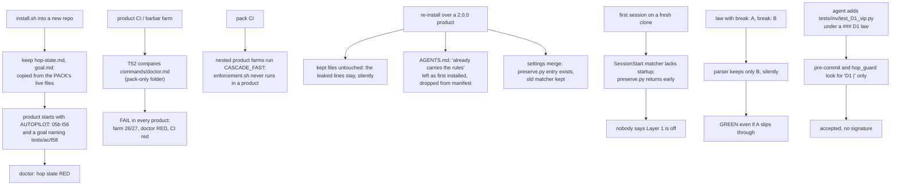
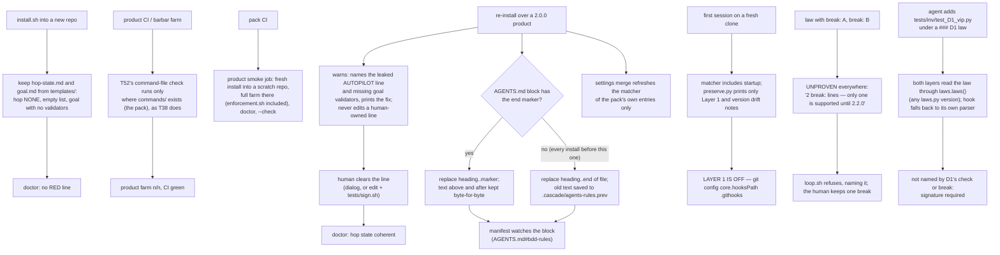

# Stage 05b — t60-install-health-multi-break — SPEC

**Scope change at the spec edge (human, "send back: defer multi-break").** Several `break:` lines per law is
deferred to its own slice and release (2.2.0). In its place this slice closes the trap that exists today: a
second `break:` line is silently ignored. This release is **2.1.1**. The slug keeps its name because
`CURRENT_SLICE` and the critique file are keyed on it; renaming would reset the critique's provenance (see "Not in
this slice").

## User story IDs from the PRD

BDD's product is the cascade itself; the stories this slice serves:

- **S-IH1** — As an operator installing BDD into a new repo, I start from a clean slate: no hop, no overnight
  list and no goal that belong to the pack's own development. If an earlier install already gave me the pack's
  state, the upgrade tells me which lines to clear and how to sign that.
- **S-IH2** — As an operator of any product, `bash tests/barbar.sh`, doctor and my CI go green when my product is
  healthy. A check that can only pass inside the pack repo never runs in mine, and the pack's own CI proves that
  by running the full suite inside a freshly installed product.
- **S-IH3** — As an operator upgrading BDD, the rules my agent reads (`AGENTS.md`) are the rules of the version I
  installed, my own rules above them are untouched, and a later edit to the cascade rules shows up as drift.
- **S-IH4** — As an operator opening the first session on a fresh clone, I am told that the git-hook layer is off.
- **S-IH5** — As a law author, a second `break:` line I write is never silently ignored: the law is held back as
  UNPROVEN with a message saying why, until several breaks are supported.
- **S-IH6** — As an operator whose laws use the `### D1` form the template teaches, an agent cannot add a new test
  under my law without my signature, the same protection one-line laws already have.

## The problem, stated as cost

Measured this session by installing 2.0.0 into an empty repo, then upgrading it to 2.1.0 (both built from git):

| # | What happens | Evidence |
|---|---|---|
| 1 | A fresh product gets the **pack's own live hop state and goal**: `AUTOPILOT: 05b t56-dsharp-parallel` (doctor goes red; the Stop hook tells the product's agent to generate a slice that does not exist) and a goal naming `tests/ac/t58_divergence.sh`, which products do not have. An upgrade keeps both, because `keep` never overwrites | `install.sh:127`, `install.sh:136`, `install.sh:58`; doctor: `hop state RED — AUTOPILOT lists 05b 't56-dsharp-parallel'` |
| 2 | **T52 fails in every product**: its last line compares `commands/doctor.md`, which exists only in the pack. So `enforcement.sh` fails, the farm scores 26/27, doctor's farm line is red, and the product's CI (`control-line.yml`) is red, since 2.0.0. Nothing caught it, because every nested product farm in the suite runs with `CASCADE_FAST=1`, which skips `enforcement.sh` | `tests/enforcement.sh:1217`; `tests/enforcement.sh:301,602,1084`; in the upgraded product: `commands/doctor.md and .claude/commands/doctor.md differ` |
| 3 | A re-install **never refreshes `AGENTS.md`** ("already carries the cascade rules") and drops it from the manifest (89 → 88 files), so upgraded products keep the rules they were first installed with, unwatched | `install.sh:116`; manifest diff: `-… AGENTS.md`, no `+` |
| 4 | The **Layer 1 warning never fires on a first session**: the SessionStart hook matches only `compact\|resume\|clear`, and `preserve.py` returns early for any other source. An upgrade would not fix the matcher either, because the settings merge only adds commands a product lacks | `.claude/settings.json:46`, `hooks/hooks.json:46`, `preserve.py:53`, `install.sh:104` |
| 5 | A **second `break:` line is silently ignored**: the parser keeps the last one it reads. An author who writes two breaks believes both are proven; only the last runs, and nothing says so | `tests/lib/laws.py:49` (`cur[…] = f.group(2)` overwrites) |
| 6 | **A heading-style law's test surface is unguarded.** Both layers look the law up with the one-line pattern `^D1\s*\|`, so for `### D1` laws a new `tests/inv/test_D1_vip.py` is committed without a signature, and `hop_guard` stays silent in default and bypass modes | `.githooks/pre-commit:78`, `.claude/hooks/hop_guard.py:218`; reproduced this session: commit rc=0, no hook output |

Items 1 and 2 together mean **no product installed with 2.0.0 or 2.1.0 reports healthy**: doctor 7/9 with a
correctly working product. With the leaked line emptied by hand, doctor reaches 8/9. Only T52 is left.

Item 6 is beyond the brief (Decision 1). I found it while checking how laws are read for item 5. It sits in the
same reader, and it leaves AGENTS.md rule 5 unenforced for the law format the template teaches.

## Before vs after

Before — install copies live state, one check fails everywhere, rules go stale, a second break is ignored:

After — blank templates, pack-only checks stay in the pack and are proven so, rules refresh in place, a second
break is refused out loud:

## Benefits and trade-offs

| | What you get | What it costs | How the cost is contained | What remains |
|---|---|---|---|---|
| **Blank templates** | A fresh product starts clean; doctor has no red hop-state line | Two template files the pack must keep in step with the live ones' prose | AC1 checks both templates carry no live state; the envelope stays shipped from the live file, which is already the placeholder | Products installed earlier keep their leaked lines until a human clears them; the upgrade names the lines and the fix |
| **T52 pack-only + product smoke** | Product farms, doctors and CI stop going red over a pack-internal file, and the next pack-only assertion is caught in the pack's own CI before release | One more CI job in the pack (a fresh install plus a full farm, ~3 min) | It is in `pack-self-check.yml`, which products never receive; its own timeout | — |
| **AGENTS.md refresh** | Upgrades deliver the current rules; edits to the rules block show as drift | In an install from before this slice, text under the cascade block is replaced | The old block is saved to `.cascade/agents-rules.prev` (gitignored), and install says so; from 2.1.1 on the end marker makes the boundary exact | Products that wrote their own rules below the cascade block, against the documented layout, move them above once (Decision 2) |
| **Startup warning** | The first session on a fresh clone is told Layer 1 is off | One short hook run per session start | On startup only the Layer 1 and version-drift notes can print, and nothing when both are fine, so T15's "silent on a plain startup" still holds | — |
| **No silent second break** | Nobody gets a GREEN that proves less than they wrote | A law that already has two `break:` lines becomes UNPROVEN on upgrade, and `loop.sh` refuses until a human keeps one | The message names the law and says why; one-break and legacy laws are untouched | Several breaks per law waits for 2.2.0 |
| **Heading-style laws guarded** | Rule 5 holds for `### D1` laws, not only one-liners | An agent adding under an existing id now needs a signature | Same rule and exception as for one-liners (a file the law's own commands name); a plugin newer than the repo's `tests/lib` still guards | — |

## What the slice adds — and the line it must not cross

1. **Blank templates** (`templates/hop-state.md`, `templates/goal.md`). `install.sh` keeps these two from
   `templates/` instead of copying the pack's live `docs/cascade/` files:
   - **hop state:** the same prose, `CURRENT_HOP: NONE`, an empty stage and slice, and an empty `AUTOPILOT:` inside
     `<EDIT>`;
   - **goal:** the same header, no `GOAL_`/`VALIDATOR:` lines (`loop.sh` already refuses a goal with no bar).

   The envelope keeps shipping from `docs/cascade/envelope.md`: it is already the placeholder template (the pack
   declares no law). AC1 asserts a fresh product declares no law.

   **In an existing product** (critic C1) install **warns**, never edits. It warns when `hop-state.md`'s
   `AUTOPILOT:` names a slice with neither a spec nor a brief (the check doctor uses), and when `goal.md` has a
   `VALIDATOR: bash <path>` whose file does not exist. Each warning names the line and prints the fix: for the
   human-owned `AUTOPILOT:` line, "clear it — approve the dialog when your agent proposes it, or edit it and run
   `bash tests/sign.sh`"; for `goal.md`, which is not human-owned, "your agent rewrites it at the next EXECUTE, or
   empty it now".
2. **T52's command-file comparison runs only where `commands/` exists** — the guard T38 already uses for the same
   pack-only folder (`tests/enforcement.sh:1037`). Every other T52 assertion runs everywhere, as today.

   **Product smoke in the pack's CI** (critic C5). A new job in `pack-self-check.yml`, which is never shipped to
   products, installs the checked-out pack into a scratch repo and runs, inside it: `install.sh --check`,
   `bash tests/barbar.sh` **without** `CASCADE_FAST`, so `enforcement.sh` runs in a product, and doctor, which
   must report no RED line. That catches the whole class — a check that passes in the pack and fails in every
   product — before a release, not only T52.
3. **AGENTS.md refresh.** The pack's `AGENTS.md` gains a final end-marker line
   (`<!-- end of the Barbaric Driven Development rules … -->`). The rules block is the text from the heading line
   `# Agent rules — Barbaric Driven Development` (the same in all 14 versions of the file) to that marker, or to
   the end of the file when there is no marker, which is every install before this one. On install:
   - no heading → append the block, as today;
   - heading present → replace the block with the pack's, keeping everything above it and anything after the end
     marker byte-for-byte. When there was no marker, the replaced text is saved to `.cascade/agents-rules.prev`
     (added to `.gitignore` with the other `.cascade/` files) and install prints that it did so;
   - the manifest records `<sha> AGENTS.md#bdd-rules`, and `--check` hashes only the block, so editing your own
     rules is not drift and editing the cascade rules is.
4. **Startup warning.** The SessionStart matcher becomes `startup|compact|resume|clear` in `.claude/settings.json`
   and in the plugin's `hooks/hooks.json`. `preserve.py` accepts `startup`, and on a startup prints **only** two
   notes, each only when it applies: the plugin/repo version-drift note and `LAYER 1 IS OFF`. It prints nothing
   else, so a healthy repo's startup stays silent. That keeps T15's assertion (`enforcement.sh:158`) and keeps the
   "no law in force" nudge out of every new session (critic C2). The control-line block and the decision log stay
   compact/resume/clear only.

   The settings merge in `install.sh` now also refreshes the `matcher` of any entry whose commands are all the
   pack's own (`.claude/hooks/<one of the pack's hooks>`), so an upgraded product gets the new matcher. A product's
   own hook entries are never touched.

   `preserve.py` stops deciding "in force" itself from `--declared`, and reads `laws.py --in-force` like `seam.py`
   does (critic C8).
5. **No silent second break.** `laws.laws()` collects every `break:` line in order into `breaks`, and keeps `break`
   as the first, so any caller of the old shape still works. A heading-form law with **more than one** `break:`
   line is UNPROVEN, with the reason `2 break: lines — only one is supported until 2.2.0`:
   - `--unproven` prints that reason, so `loop.sh` refuses with it;
   - `--in-force` leaves the law out, so `seam.py` and `preserve.py` never show it as in force;
   - `--declared` prints its break field empty;
   - `dsharp_strength.sh` takes an UNPROVEN law's reason from `laws.py --unproven` instead of its own "no red twin"
     guess, so every reader gives the same reason.

   One-break and legacy one-line laws are untouched, byte-for-byte. A new `--commands` mode prints one line per
   command of every declared law, blank ones included (`id<TAB>check|break<TAB><command or empty>`), for §6
   (critic C4b).
6. **Heading-style laws guarded** (beyond the brief — Decision 1). Both layers find the law for
   `tests/inv/test_D<n>*` through `laws.laws()`, a function every shipped `laws.py` has, taking `breaks` when
   present and `[break]` otherwise:
   - **`pre-commit`** ships in the same install as `tests/lib`, so the two never differ in version; it calls
     `laws.py --commands`.
   - **`hop_guard.py`** in plugin mode can be newer than the repo's `tests/lib` (critic C4a). It imports the repo's
     `laws` module and uses `laws()`. If the import fails, it falls back to a minimal parser of its own that reads
     both law forms, so it never has less protection than today's one-line regex.

   A new file there needs a signature unless the law's check or one of its `break:` lines names it — the same
   exception as today, now for both forms.

**The line it must not cross.** No law, validator, `tests/inv/*` file or `<EDIT>` block is changed, and nothing
softens: every existing one-break and legacy law scores byte-for-byte as in 2.1.0 (AC5). A law with two `break:`
lines goes from a silently weaker GREEN to UNPROVEN, which is stricter, never looser. Every file an install kept
before is still kept; T52 loses no assertion in the pack; T15 is not edited and stays green. Install never edits a
human-owned line: it warns and prints the fix. The rules-block refresh never touches text above the heading or
after the end marker.

## Acceptance criteria

- **AC1 — fresh install is clean; an upgrade names what to clear.** Use a scratch copy of the pack whose live
  `hop-state.md` says `AUTOPILOT: 05b leaked` and whose `goal.md` names `tests/ac/leaked.sh`. An install into an
  empty repo then gives: `CURRENT_HOP: NONE`, an empty slice, an empty `AUTOPILOT:`, a goal with no `VALIDATOR:`
  line, no `leaked` anywhere, `laws.py --declared` empty, `install.sh --check` clean, and doctor's hop-state line
  not RED. Re-installing over a product that already has `AUTOPILOT: 05b leaked` and the leaked goal prints both
  warnings with their fixes and leaves both files byte-identical.
  **Red twins:** the scratch pack with the old `keep docs/cascade/…` lines restored leaks `leaked`; an
  `install.sh` with the warnings removed stays silent. Either makes AC1 fail.
- **AC2 — T52 in a product.** T52, extracted from `enforcement.sh` and run inside a freshly installed product,
  passes. In the pack it still fails when `commands/doctor.md` and `.claude/commands/doctor.md` differ. A product
  with its own root `install.sh` still passes (critic C7). **Red twin:** the unguarded comparison fails in the
  product.
- **AC3 — AGENTS.md refresh.** Three products: (a) own rules + a 2.0.0-style appended block (no end marker, one line
  altered to stand for an old rule); (b) a pure copy of an old `AGENTS.md`; (c) own rules above, and a note *after*
  a block that has the end marker. After a re-install, each block equals the pack's `AGENTS.md`, own rules and the
  after-marker note are byte-identical, `.cascade/agents-rules.prev` holds the replaced text for (a) and (b), the
  manifest has `AGENTS.md#bdd-rules`, and `--check` is clean. Then editing a line inside the block makes `--check`
  report `DRIFTED  AGENTS.md#bdd-rules`, while editing the own rules does not. **Red twin:** the old install leaves
  (a)'s altered rule in place, so AC3 fails.
- **AC4 — startup warning (enforcement T60).** `preserve.py` given `source: startup` in a repo with `.githooks/` and
  no `core.hooksPath` prints `LAYER 1 IS OFF` and nothing from the control-line block; with `core.hooksPath` set it
  prints nothing, whether or not a law is in force (T15 unchanged and green). `source: compact` still prints the
  full block. A law with two `break:` lines is not shown as IN FORCE by `preserve.py`. The pack's `settings.json`
  and `hooks/hooks.json` matchers include `startup`. The settings merge turns a product's old `compact|resume|clear`
  pack entry into the new matcher and leaves a product-owned hook entry byte-identical. **Red twins:** the old
  early return prints nothing on startup; a merge without the matcher refresh leaves the old matcher. Either makes
  T60 fail.
- **AC5 — no silent second break.** An envelope with: D2 a heading law, check `true`, breaks `false` then `true` →
  `UNPROVEN  D2 … (2 break: lines — only one is supported until 2.2.0)` from `dsharp_strength.sh`; `loop.sh` refuses
  naming D2 with that reason; `laws.py --in-force` leaves D2 out; `--commands` lists both of D2's break lines.
  D4 a one-break heading law and D5 a legacy one-liner → lines byte-identical to 2.1.0's `dsharp_strength.sh`
  (embedded in the AC); `DSHARP_JOBS=4` prints the same report. **Red twin:** the old last-wins `laws.py` sees only
  D2's last break (`true`) and scores it THEATER, never UNPROVEN, so AC5 fails.
- **AC6 — heading-style laws guarded (enforcement T60).** With `### D1` whose check names `tests/inv/test_D1.py`:
  committing a new `tests/inv/test_D1_vip.py` is BLOCKED at pre-commit without a signature, and `hop_guard` asks
  (default) or denies (bypass). Creating `tests/inv/test_D1.py` itself is allowed at both layers, and so is a file
  named only by the law's `break:` line. A law whose commands are TODO still guards its id. With a **pre-t60
  `tests/lib/laws.py`** in the repo and the new hook (plugin skew), `hop_guard` still guards both a legacy and a
  heading-style law. The legacy form behaves as today (T26 unchanged). **Red twin:** the old one-line regex lets
  `test_D1_vip.py` through at both layers.
- **AC7 — nothing else moves, and the upgrade story holds.** `bash tests/enforcement.sh` (T8–T59, T15 unedited,
  plus T60), the t57/t58/t59 AC scripts and `bash tests/lint.sh` stay green. Repeat the 2.0.0 → 2.1.1 upgrade of a
  scratch product and paste the result into the hop report. After the upgrade, doctor's **farm** line is no longer
  red (T52), `--check` is clean, and install has printed the leaked-line warning. The hop-state line stays RED
  until the human's step (critic C3). After that step — clearing the line, done in the scratch repo with
  `CASCADE_HUMAN=1`, which is how the suite already stands in for a human — doctor reports no RED line.
- **AC8 — product smoke in the pack's CI.** The new `pack-self-check.yml` job passes on this branch: fresh install,
  `--check` clean, the full farm n/n inside the product, and doctor with no RED line. **Red twin:** the same job
  run against 2.1.0 fails (T52), shown once in the hop report.

## Laws

`NO D# IN FORCE`. `envelope.md` declares no law (its only `###` block is the `{{…}}` template). This slice proposes
none. It changes how laws are *read*, never what any law says; no `tests/inv/*` file is touched (I13). The new
tests are `tests/ac/t60_install_health.sh`, `T60` in `tests/enforcement.sh`, and the product-smoke CI job.

## PLAN

0. **`templates/`** — `hop-state.md` and `goal.md` per §1.
1. **`install.sh`** — `keep` gains an optional source (`keep <dest> [<src>]`); hop state and goal kept from
   `templates/`; the leaked-state warnings with their fixes (§1); the AGENTS.md block refresh, the
   `.cascade/agents-rules.prev` ignore line and the `AGENTS.md#bdd-rules` manifest entry (§3); `--check` hashes that
   entry's block; the settings merge refreshes the matcher of the pack's own entries (§4).
2. **`AGENTS.md`** — the end-marker line (§3). Nothing else in it changes.
3. **`tests/enforcement.sh` T52** — the `commands/` guard on the command-file comparison (§2).
4. **`.github/workflows/pack-self-check.yml`** — the product-smoke job (§2, AC8).
5. **SessionStart** — `.claude/settings.json` and `hooks/hooks.json` matchers; `preserve.py`'s startup branch and its
   `--in-force` read; its docstring (§4).
6. **`tests/lib/laws.py`** — `breaks`; UNPROVEN on a second `break:` line; the `--commands` mode with blank slots
   (§5).
7. **`tests/dsharp_strength.sh`** — an UNPROVEN law's reason comes from `laws.py --unproven` (§5). Nothing else in it
   changes.
8. **`.githooks/pre-commit`, `.claude/hooks/hop_guard.py`** — look up `tests/inv/test_D<n>*` through `laws` with
   hop_guard's own fallback parser (§6).
9. **Tests** — `tests/ac/t60_install_health.sh` (AC1, AC2, AC3, AC5, each with its red twins, using
   `GIT_CONFIG_GLOBAL=/dev/null`); `tests/enforcement.sh` T60 (AC4, AC6, through the real hooks).
10. **Docs** — USAGE.md §B4 (one `break:` per law until 2.2.0, and what the UNPROVEN message means), §B6 (upgrading
    refreshes the AGENTS.md rules block; `.cascade/agents-rules.prev`; clearing a leaked line), §B7 (the
    two-break and leaked-state messages); INTEGRATION.md:129 (SessionStart now includes startup); CONTROL-LINE.md
    T60 row and the T8–T60 ranges.
11. **Version** — `VERSION`, `plugin.json`, `marketplace.json` → **2.1.1**, and a CHANGELOG entry.
12. **Verify** — `goal.md`: the t60 AC script, the t57/t58/t59 AC scripts, `bash tests/enforcement.sh`,
    `bash tests/lint.sh`. Run `bash tests/loop.sh` to n/n; run the product smoke locally; repeat the 2.0.0 → 2.1.1
    upgrade and paste doctor and `--check` into the hop report (AC7); re-read the diff adversarially.

**Not in this slice:**
- **Several `break:` lines per law** — deferred by the human at this edge; its own slice and release (2.2.0). The
  design in the previous revision of this spec (`963b119`, §5) is the starting point: GREEN only when every break
  fails, THEATER naming the break that passed, a TODO break making the law UNPROVEN.
- **"This requirement needs no law" as a signed decision per FR** (review point 2) — its own brief; it changes the
  audit's shape.
- **Hermetic git config in every fixture builder**, **split and parallel `enforcement.sh`**, **per-slice case
  selection**, **parallel validators**, **no duplicate runs**, a **stage-10 audit receipt**, **laws across CI
  runners** — carried over from t59's list, unchanged.
- **The `|` in a check command** — `--declared`'s `id|law|check|break` line splits a check that contains a shell
  pipe. It is old and unrelated; `--commands` avoids it for the new readers. Its own brief.
- **Critique provenance survives delete + re-add** — `tests/lib/provenance.py` anchors on the *latest* commit that
  added the critique file (`git log --diff-filter=A -1`), so deleting it and adding new rows resets the check. This
  hop used exactly that path, disclosed and on the human's choice, to record the critic's own re-issue of C6
  (`6134544`, `df64aed`); an author could use it to replace the critic's words. Anchor on the *first* add, and let
  a re-issue be recorded as a signed or explicitly marked event. Its own brief.

## Decisions for the human (flag at the edge)

Critique: `05b-t60-install-health-multi-break-critique.md` — 10 findings, all answered `fixed`; none left for you.
On your choice, the critic re-issued its rows with only C6's evidence restated (the gate could not read
`spec:97`); the original is withdrawn in `6134544` and kept in history at `fa7fe61`. The critique reviewed the
larger scope (`963b119`). This revision removes multi-break and adds the small second-break guard (§5, AC5); the
guard was not seen by the critic.

1. **Item 6 is beyond your brief.** You asked for the 2.1.1 fixes plus the startup warning. While reading how laws
   are parsed, I found that neither layer guards a heading-style law's test surface (reproduced: the commit went
   through, and `hop_guard` said nothing). It is the same reader as item 5 and a small change, so I put it in.
   Strike it at this edge and it becomes its own slice.
2. **AGENTS.md text below the cascade block.** In every install before this one, whatever sits under the rules block
   is treated as part of it and replaced. It is saved to `.cascade/agents-rules.prev`, and install says so. The
   documented layout puts your rules above; if you know products that put theirs below, say so and I will make the
   refresh refuse instead.
3. **Products that already got the leaked lines** are not fixed by the upgrade alone. The `AUTOPILOT:` line is
   yours, so install names it and prints how to clear it, and doctor stays red on it until you do.
4. **A law that already has two `break:` lines** becomes UNPROVEN on upgrade, so `loop.sh` refuses until a human
   keeps one. That is stricter than today, where the first break is silently ignored. I know of no product with
   such a law; this repo has none.
