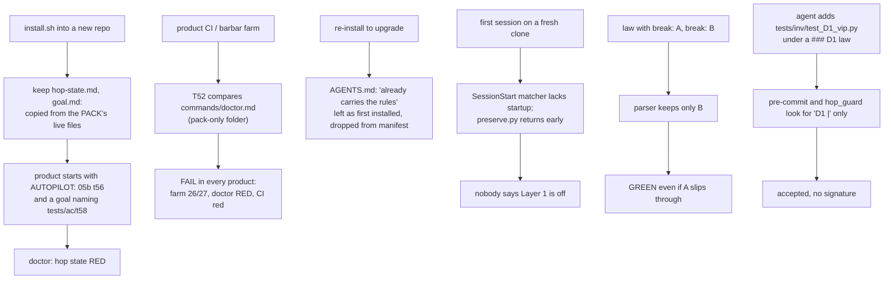
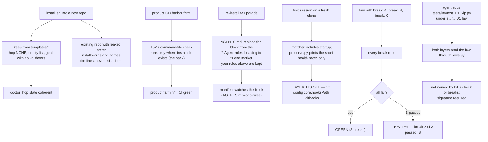

# Stage 05b — t60-install-health-multi-break — SPEC

## User story IDs from the PRD

BDD's product is the cascade itself; the stories this slice serves:

- **S-IH1** — As an operator installing BDD into a new repo, I start from a clean slate: no hop, no overnight
  list and no goal that belong to the pack's own development.
- **S-IH2** — As an operator of any product, `bash tests/barbar.sh`, doctor and my CI go green when my product is
  healthy. A check that can only pass inside the pack repo never runs in mine.
- **S-IH3** — As an operator upgrading BDD, the rules my agent reads (`AGENTS.md`) are the rules of the version I
  installed, my own rules above them are untouched, and a later edit to the cascade rules shows up as drift.
- **S-IH4** — As an operator opening the first session on a fresh clone, I am told that the git-hook layer is off.
- **S-IH5** — As a law author, I can give a law several bugs it must catch (`break:` lines). The law counts only
  when its test catches every one of them.
- **S-IH6** — As an operator whose laws use the `### D1` form the template teaches, an agent cannot add a new test
  under my law without my signature, the same protection one-line laws already have.

## The problem, stated as cost

Measured this session by installing 2.0.0 into an empty repo, then upgrading it to 2.1.0 (both built from git):

| # | What happens | Evidence |
|---|---|---|
| 1 | A fresh product gets the **pack's own live hop state and goal**: `AUTOPILOT: 05b t56-dsharp-parallel` (doctor goes red; the Stop hook tells the product's agent to generate a slice that does not exist) and a goal naming `tests/ac/t58_divergence.sh`, which products do not have | `install.sh:127`, `install.sh:136` (`keep` copies `$SRC/<file>`); doctor: `hop state RED — AUTOPILOT lists 05b 't56-dsharp-parallel'` |
| 2 | **T52 fails in every product**: its last line compares `commands/doctor.md`, which exists only in the pack. So `enforcement.sh` fails, the farm scores 26/27, doctor's farm line is red, and the product's CI (`control-line.yml`) is red, since 2.0.0 | `tests/enforcement.sh:1217`; in the upgraded product: `commands/doctor.md and .claude/commands/doctor.md differ` |
| 3 | A re-install **never refreshes `AGENTS.md`** ("already carries the cascade rules") and drops it from the manifest (89 → 88 files), so upgraded products keep the rules they were first installed with, unwatched | `install.sh:116`; manifest diff: `-… AGENTS.md`, no `+` |
| 4 | The **Layer 1 warning never fires on a first session**: the SessionStart hook matches only `compact\|resume\|clear`, and `preserve.py` returns early for any other source. An upgrade would not fix the matcher either, because the settings merge only adds commands a product lacks | `.claude/settings.json:46`, `hooks/hooks.json:46`, `preserve.py:53`, `install.sh:104` |
| 5 | A law has **one `break:`**. A second `break:` line is silently ignored: the parser keeps the last one it reads. So the strength check proves the test catches one bug and nothing more | `tests/lib/laws.py:49` (`cur[…] = f.group(2)` overwrites) |
| 6 | **A heading-style law's test surface is unguarded.** Both layers look the law up with the one-line pattern `^D1\s*\|`, so for `### D1` laws a new `tests/inv/test_D1_vip.py` is committed without a signature, and `hop_guard` stays silent in default and bypass modes | `.githooks/pre-commit:78`, `.claude/hooks/hop_guard.py:218`; reproduced this session: commit rc=0, no hook output |

Items 1 and 2 together mean **no product installed with 2.0.0 or 2.1.0 reports healthy**: doctor 7/9 with a
correctly working product. With the leaked line emptied by hand, doctor reaches 8/9. Only T52 is left.

Item 6 is beyond the brief (see Decision 1). I found it while checking how laws are read for item 5. It sits in
the same reader, and it leaves AGENTS.md rule 5 unenforced for the law format the template teaches.

## Before vs after

Before — install copies live state, one check fails everywhere, rules go stale, laws prove one bug:

After — blank templates, pack-only checks stay in the pack, rules refresh in place, every break must fail:

## Benefits and trade-offs

| | What you get | What it costs | How the cost is contained | What remains |
|---|---|---|---|---|
| **Blank templates** | A fresh product starts clean; doctor's hop-state line is coherent | Three template files the pack must keep in step with the live ones | AC1 checks that each template carries no live state | Products already installed keep their leaked lines until a human clears them; install now names them |
| **T52 pack-only** | Product farms, doctors and CI stop going red over a pack-internal file | None | The check still runs, unchanged, in the pack | — |
| **AGENTS.md refresh** | Upgrades deliver the current rules; edits to the rules block show as drift | A block that has lost its end marker, or text a product added *below* it, is replaced | The old block is saved to `.cascade/agents-rules.prev` (gitignored) and install says so; the end marker makes the boundary exact from 2.1.1 on | Products that wrote their own rules below the cascade block, against the documented layout, must move them above once |
| **Startup warning** | The first session on a fresh clone is told Layer 1 is off | One short hook run per session start | On startup only the health notes print (plugin drift, Layer 1, no law in force), not the whole control-line block | — |
| **Several breaks per law** | A law can prove its test catches the overdraft, the concurrent double debit and the replay, all at once | Each break is one more test run in the strength check and the merge gate | Opt-in per law; one-break and legacy laws run exactly as today | A break still proves only what its author thought of (point 2 of the review: undeclared rules stay undeclared) |
| **Heading-style laws guarded** | Rule 5 holds for `### D1` laws, not only one-liners | An agent adding a legitimate *new* law's test is unaffected; one adding under an existing id now needs a signature | Same rule, same exception (a file the law's own commands name) as for one-liners | — |

## What the slice adds — and the line it must not cross

1. **Blank templates** (`templates/hop-state.md`, `templates/goal.md`, `templates/envelope.md`). `install.sh` keeps
   these from `templates/` instead of copying the pack's live `docs/cascade/` files. They hold:
   - **hop state:** the same prose, `CURRENT_HOP: NONE`, an empty stage and slice, and an empty `AUTOPILOT:`
     inside `<EDIT>`;
   - **goal:** the same header, no `GOAL_`/`VALIDATOR:` lines (`loop.sh` already refuses a goal with no bar);
   - **envelope:** the current placeholder envelope, so a law the pack might declare one day cannot leak either.

   `keep` is unchanged for every other file. In an existing product, install **warns** — never edits — when
   `hop-state.md`'s `AUTOPILOT:` names a slice with neither a spec nor a brief (the check doctor already uses), or
   when `goal.md` has a `VALIDATOR: bash <path>` whose file does not exist. The warning names the line and says the
   human owns it.
2. **T52's command-file comparison runs only in the pack** — where `install.sh` exists, the marker `lint.sh:17`
   already uses ("products have no install.sh"). Every other T52 assertion runs everywhere, as today.
3. **AGENTS.md refresh.** The pack's `AGENTS.md` gains a final end-marker line
   (`<!-- end of the Barbaric Driven Development rules … -->`). The rules block is the text from the heading line
   `# Agent rules — Barbaric Driven Development` (the same in all 14 versions of the file) to that marker, or to
   the end of the file when there is no marker (older installs). On install:
   - no heading → append the block, as today;
   - heading present → replace the block with the pack's, keeping everything above it and anything after the end
     marker byte-for-byte. When there was no marker, the replaced text is saved to `.cascade/agents-rules.prev`
     (added to `.gitignore` with the other `.cascade/` files) and install prints that it did so;
   - the manifest records `<sha> AGENTS.md#bdd-rules`, and `--check` hashes only the block, so editing your own
     rules is not drift and editing the cascade rules is.
4. **Startup warning.** The SessionStart matcher becomes `startup|compact|resume|clear` in `.claude/settings.json`
   and in the plugin's `hooks/hooks.json`. `preserve.py` accepts `startup`. On a startup it prints **only** the
   short notes (the plugin/repo version drift note, `LAYER 1 IS OFF`, `CASCADE NOT INITIALIZED`), and nothing at
   all when none applies. It does not print the control-line block or the decision log, which exist to repair
   context after a break. The settings merge in `install.sh` now also refreshes the `matcher` of an entry whose
   commands are all the pack's own, so an upgraded product gets the new matcher; a product's own hook entries are
   never touched.
5. **Several `break:` lines per law** (heading form). `laws.py` collects every `break:` line in order. A law is in
   force when its check and **every** break are runnable; a blank or `TODO` break makes it UNPROVEN, naming which
   break (`break 2 is TODO`). The one-line legacy form keeps its single break. `--declared` and `--in-force` keep
   today's `id|law|check|break` output (the first break), so every existing reader works unchanged. A new
   `--commands` mode prints `id<TAB>check|break<TAB>command` for every command. `dsharp_strength.sh` runs the check
   and then every break: GREEN only if all breaks fail; otherwise THEATER, naming the first break that passed
   (`break 2 of 3 passed: <cmd>`). A multi-break GREEN line adds `(3 breaks)`; one-break lines are byte-identical
   to today's. The parallel mode (`DSHARP_JOBS`) and the merge gate inherit this with no further change.
6. **Heading-style laws guarded** (beyond the brief — Decision 1). `pre-commit` and `hop_guard.py` find the law for
   `tests/inv/test_D<n>*` through `laws.py --commands` instead of the one-line regex. A new file there needs a
   signature unless the law's check or one of its breaks names it — the same exception as today, now for both law
   forms.

**The line it must not cross.** No law, validator, `tests/inv/*` file or `<EDIT>` block is changed, and nothing
softens: every existing one-break and legacy law scores byte-for-byte as in 2.1.0 (AC5); every file an install
kept before is still kept; T52 loses no assertion in the pack. Install never edits a human-owned line: it warns.
The rules-block refresh never touches text above the heading or after the end marker.

## Acceptance criteria

- **AC1 — fresh install is clean.** Using a scratch copy of the pack whose live `hop-state.md` says
  `AUTOPILOT: 05b leaked` and whose `goal.md` names `tests/ac/leaked.sh`, an install into an empty repo gives:
  `CURRENT_HOP: NONE`, an empty slice, an empty `AUTOPILOT:`, a goal with no `VALIDATOR:` line, no `leaked`
  anywhere, `install.sh --check` clean, and doctor's hop-state line not RED. Re-installing over a product that
  already has `AUTOPILOT: 05b leaked` warns and names the line, and leaves it unchanged. **Red twin:** the same
  scratch pack with the old `keep docs/cascade/…` lines restored leaks `leaked`, so AC1 fails.
- **AC2 — T52 in a product.** T52, extracted from `enforcement.sh` and run inside a freshly installed product,
  passes. In the pack it still fails when `commands/doctor.md` and `.claude/commands/doctor.md` differ.
  **Red twin:** the unguarded comparison fails in the product.
- **AC3 — AGENTS.md refresh.** Three products: (a) own rules + a 2.0.0-style appended block (no end marker, one
  line altered to stand for an old rule); (b) a pure copy of an old `AGENTS.md`; (c) own rules above, and a note
  *after* a block that has the end marker. After a re-install, each block equals the pack's `AGENTS.md`, own rules
  and the after-marker note are byte-identical, `.cascade/agents-rules.prev` holds the replaced text for (a) and
  (b), the manifest has `AGENTS.md#bdd-rules`, and `--check` is clean. Then editing a line inside the block makes
  `--check` report `DRIFTED  AGENTS.md#bdd-rules`, while editing the own rules does not. **Red twin:** the old
  install leaves (a)'s altered rule in place, so AC3 fails.
- **AC4 — startup warning (enforcement T60).** `preserve.py` given `source: startup` in a repo with `.githooks/` and
  no `core.hooksPath` prints `LAYER 1 IS OFF` and no control-line block; with `core.hooksPath` set and a law in
  force it prints nothing; `source: compact` still prints the full block. The pack's `settings.json` and
  `hooks/hooks.json` matchers include `startup`. The settings merge turns a product's old
  `compact|resume|clear` entry into the new matcher and leaves a product-owned hook entry unchanged.
  **Red twin:** the old early return (`source not in (compact, resume, clear)`) prints nothing on startup, so T60
  fails.
- **AC5 — several breaks.** An envelope with: D1 check `true`, breaks `false`/`false`/`false` → `GREEN D1 … (3
  breaks)`; D2 check `true`, breaks `false`/`true`/`false` → `THEATER D2 … break 2 of 3 passed: true`; D3 check
  `true`, breaks `false`/`TODO` → `UNPROVEN D3 … (break 2 is TODO)`; D4 a one-break heading law and D5 a legacy
  one-liner → lines byte-identical to 2.1.0's `dsharp_strength.sh` (embedded in the AC). `DSHARP_JOBS=4` prints the
  same report. The merge gate on a fixture whose only law is D2 is REFUSED with `D# THEATER`. **Red twin:** the old
  last-wins `laws.py` scores D2 GREEN (its last break fails), so AC5 fails.
- **AC6 — heading-style laws guarded.** With `### D1` whose check names `tests/inv/test_D1.py`: committing a new
  `tests/inv/test_D1_vip.py` is BLOCKED at pre-commit without a signature, and `hop_guard` asks (default) or denies
  (bypass). Creating `tests/inv/test_D1.py` itself is allowed at both layers. A file named only by a law's *second*
  break is also allowed. The same holds for the legacy form (T26 unchanged). **Red twin:** the old one-line regex
  lets `test_D1_vip.py` through at both layers.
- **AC7 — nothing else moves.** `bash tests/enforcement.sh` (T8–T59, plus T60 for AC4 and AC6), the t57/t58/t59 AC
  scripts and `bash tests/lint.sh` stay green. The 2.0.0 → 2.1.1 upgrade of the scratch product used for the
  evidence above ends with doctor's hop state and farm lines no longer red because of items 1 and 2, and
  `--check` clean.

## Laws

`NO D# IN FORCE`. `envelope.md` declares no law (its only `###` block is the `{{…}}` template). This slice proposes
none. It changes how laws are *read* and scored, never what any law says; no `tests/inv/*` file is touched (I13).
The new tests are `tests/ac/t60_install_health.sh` and `T60` in `tests/enforcement.sh`.

## PLAN

0. **`templates/`** — `hop-state.md`, `goal.md` and `envelope.md` per §1.
1. **`install.sh`** — `keep` gains an optional source (`keep <dest> [<src>]`); hop state, goal and envelope are kept
   from `templates/`; the leaked-state warnings (§1); the AGENTS.md block refresh, the `.cascade/agents-rules.prev`
   ignore line and the `AGENTS.md#bdd-rules` manifest entry (§3); `--check` hashes that entry's block; the settings
   merge refreshes the matcher of the pack's own entries (§4).
2. **`AGENTS.md`** — the end-marker line (§3). Nothing else in it changes.
3. **`tests/enforcement.sh` T52** — the pack-only guard on the command-file comparison (§2).
4. **SessionStart** — `.claude/settings.json` and `hooks/hooks.json` matchers; `preserve.py` startup branch (§4).
5. **`tests/lib/laws.py`** — collect breaks; UNPROVEN on a blank break; the `--commands` mode (§5).
6. **`tests/dsharp_strength.sh`** — run every break; the THEATER line names the one that passed; `(n breaks)` on a
   multi-break GREEN (§5).
7. **`.githooks/pre-commit`, `.claude/hooks/hop_guard.py`** — look up `tests/inv/test_D<n>*` through
   `laws.py --commands` (§6).
8. **Tests** — `tests/ac/t60_install_health.sh` (AC1, AC2, AC3, AC5, each with its red twin, using
   `GIT_CONFIG_GLOBAL=/dev/null`); `tests/enforcement.sh` T60 (AC4, AC6, through the real hooks).
9. **Docs** — USAGE.md §B4 (several breaks: the shape, and that each break is one more test run), §B6 (upgrading
   refreshes the AGENTS.md rules block; `.cascade/agents-rules.prev`), §B7 (the THEATER-break and leaked-state
   messages); CONTROL-LINE.md T60 row and the T8–T60 ranges; the pack's `docs/cascade/envelope.md` prose outside
   `<EDIT>` mentions several breaks without writing a `break:` line, since those lines are human-owned.
10. **Version** — `VERSION`, `plugin.json`, `marketplace.json` → the version you pick (Decision 2), and a CHANGELOG
    entry.
11. **Verify** — `goal.md`: the t60 AC script, t57/t58/t59 AC scripts, `bash tests/enforcement.sh`,
    `bash tests/lint.sh`. Run `bash tests/loop.sh` to n/n; repeat the 2.0.0 → new-version upgrade of a scratch
    product and paste doctor and `--check` into the hop report (AC7); re-read the diff adversarially.

**Not in this slice:**
- **"This requirement needs no law" as a signed decision per FR** (review point 2) — its own brief; it changes the
  audit's shape.
- **Hermetic git config in every fixture builder**, **split and parallel `enforcement.sh`**, **per-slice case
  selection**, **parallel validators**, **no duplicate runs**, a **stage-10 audit receipt**, **laws across CI
  runners** — carried over from t59's list, unchanged.
- **The `|` in a check command** — `--declared`'s `id|law|check|break` line splits a check that contains a shell
  pipe. It is old and unrelated to breaks; `--commands` avoids it for the new readers. Its own brief.

## Decisions for the human (flag at the edge)

1. **Item 6 is beyond your brief.** You asked for the 2.1.1 fixes plus multi-break and the startup warning. While
   reading how laws are parsed, I found that neither layer guards a heading-style law's test surface
   (reproduced: the commit went through, and `hop_guard` said nothing). It is the same reader as item 5 and a
   small change, so I put it in. Strike it at this edge and it becomes its own slice.
2. **Version: 2.1.1 or 2.2.0.** You asked for 2.1.1. Several `break:` lines is new envelope syntax, and a patch
   release adding syntax breaks semver's promise; by that rule this is **2.2.0**. Items 1–4 and 6 alone would be a
   clean 2.1.1. Your call; the plan uses the number you name.
3. **AGENTS.md text below the cascade block.** In an older install, whatever sits under the rules block is
   treated as part of it and replaced. It is saved to `.cascade/agents-rules.prev`, and install says so. The
   documented layout puts your rules above; if you know products that put theirs below, say so and I will make
   the refresh refuse instead.
4. **Startup output is minimal by design.** A new session gets only the health notes that apply. The full
   control-line block stays a context-repair tool for compact, resume and clear.
